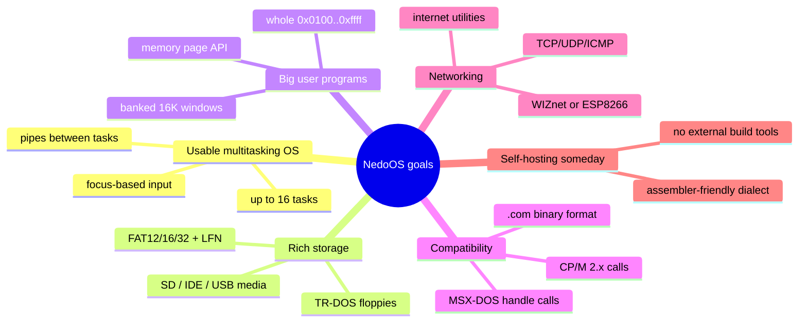

# Goals, Functional Requirements & Constraints

*Prev: [Overview](overview.md) · Next: [Hardware platforms](hardware-platforms.md)*

This page reconstructs *what NedoOS is required to do* (functional requirements),
*how well* (non-functional requirements) and *what it must live within*
(constraints). Requirements are synthesized from the official feature list in
[`NedoOS/src/nedoos.txt`](../../NedoOS/src/nedoos.txt), the API contracts in
`api_base.txt` / `api_net.txt`, and the observable behaviour of the kernel.

## Project goals

The overarching goal, quoted from the manual: to give the user *"the whole memory
between 0x0100..0xffff"* with OS-mediated window switching, while running up to
16 concurrent tasks — and to eventually assemble itself on-target.

## Functional requirements

### FR-1 Process management

| ID | Requirement | Implementation anchor |
|---|---|---|
| FR-1.1 | Run up to 16 tasks concurrently | `MAXAPPS=16`, app table in `syskrnl.asm` |
| FR-1.2 | Tasks may be *active* or *frozen*; `OS_FREEZEAPP`/`OS_RUNAPP` toggle | flags `factive`, `fgfx`, `fwaiting` |
| FR-1.3 | Exactly one task holds *focus* (owns keyboard/mouse and visible screen) | `focusappaddr` variable |
| FR-1.4 | `QUIT` terminates a task, frees pages, closes handles; result delivered to parent | `rst 0x00` → `sys_quit` |
| FR-1.5 | Parent can `WAITPID` on a child and read its exit code (`CMD_GETCHILDRESULT`) | `WAITPID` macro in `sys_h.asm` |
| FR-1.6 | A task may detach from parent (`OS_HIDEFROMPARENT`) | `CMD_HIDEFROMPARENT` |
| FR-1.7 | `YIELD` returns the remainder of the timeslice; `YIELDKEEP` may be re-entered within the same frame | `CMD_YIELD`, `CMD_YIELDKEEP` |
| FR-1.8 | Task creation from the shell: `.com` → new task; `.bat` → sequential script execution | `cmd.asm` |

### FR-2 Memory management

| ID | Requirement | Implementation anchor |
|---|---|---|
| FR-2.1 | Each task owns the address range `0x0100..0xffff`; 16K windows switch via RST/BDOS | `SETPG4000/8000/C000`, `OS_SETMAINPAGE` |
| FR-2.2 | Dynamic allocation of 16K pages (`OS_NEWPAGE`/`OS_DELPAGE`) with ownership query | `CMD_NEWPAGE`, `CMD_DELPAGE`, `CMD_GETPAGEOWNER` |
| FR-2.3 | Command line passed at `0x0080` (CP/M style), max 127 chars + length byte | `COMMANDLINE` in `sysdefs.asm` |
| FR-2.4 | User stack starts near `0x0000` growing down; may be moved anywhere above `0x3b00` | `api_base.txt` task definition |
| FR-2.5 | A task may replace the interrupt handler at `0x0038` and still call OS services | documented swap protocol |

### FR-3 File systems

| ID | Requirement | Implementation anchor |
|---|---|---|
| FR-3.1 | Volume letters: `A..D` TR-DOS floppies, `E..H` IDE master, `I..L` IDE slave, `M` SD (Z-controller), `N` SD (NeoGS), `O` USB flash | drive mount logic, `nedoos.txt` |
| FR-3.2 | FAT12/16/32 with long file names via ChaN FatFS | `fatfs4os/ff.c`, `ffconf.h` |
| FR-3.3 | TR-DOS directories incl. *segmented sequential-access files of any size* | `trdosfs.asm` |
| FR-3.4 | 8 open FAT files + 8 TR-DOS files + 8 pipes concurrently | `MAXFILES=16`, `MAXPIPES=8` |
| FR-3.5 | Handle-based API (MSX-DOS style) with read/write/seek/tell, plus legacy CP/M FCB calls | `CMD_OPENHANDLE`… |
| FR-3.6 | Per-task current drive and current directory; paths up to 256 bytes (`MAXPATH_sz`) | `app.vol`, `app.dircluster` |
| FR-3.7 | Directory enumeration (`OS_OPENDIR`/`OS_READDIR`) returning `FILINFO` | `CMD_OPENDIR`, `CMD_READDIR` |
| FR-3.8 | Raw sector access for trusted tools (`OS_READSECTORS`/`OS_WRITESECTORS`) | `CMD_READSECTORS`, `CMD_WRITESECTORS` |
| FR-3.9 | File timestamps get/set (Mr.Gluk RTC) | `CMD_GET/SETFILETIME` |

### FR-4 Inter-process communication

| ID | Requirement | Implementation anchor |
|---|---|---|
| FR-4.1 | Up to 8 byte-stream pipes, usable as a task's stdin/stdout/stderr | `vol_pipe=25`, `PIPEBUF_SZ=255` |
| FR-4.2 | `term` console server and `netterm` (Telnet, port 2323) attach pipes to running programs | `term.asm`, `netterm.asm` |
| FR-4.3 | Shell redirection `>`, `|`, `<` between commands and programs | `cmd.asm` |

### FR-5 User interface

| ID | Requirement | Implementation anchor |
|---|---|---|
| FR-5.1 | Text mode 80×25 and graphics modes 320×200×16 (EGA), 640×200 (MC), 6912 | `OS_SETGFX` values 0/2/3/6 |
| FR-5.2 | Per-task 32-byte DDp palette; restored on focus switch | `app.pal`, `setgfxpal_focus` |
| FR-5.3 | Key/mouse/joystick input delivered only to focused task (`OS_GETKEY`) | `rst 0x08` handler |
| FR-5.4 | Unfocused tasks may poll raw keyboard matrix (`OS_GETKEYMATRIX`) | `CMD_GETKEYMATRIX` |
| FR-5.5 | Key injection for automation (`OS_PUTKEY`), incl. focus-switch synthesis | `CMD_PUTKEY` |
| FR-5.6 | Dual hardware screens per task with `OS_SETSCREEN`, needed for interlaced formats | `app.screen`, `CMD_SETSCREEN` |
| FR-5.7 | RU/EN layouts: ШВЕРТЫ typewriter layout with two-key digraphs; CP866/CP1125 | `syskey2.asm` |

### FR-6 Sound

| ID | Requirement | Implementation anchor |
|---|---|---|
| FR-6.1 | Background PT3 music per task on AY, TurboSound-aware (`OS_SETMUSIC`) | `CMD_SETMUSIC` |
| FR-6.2 | Blocking 8-bit PCM playback through Covox with a page table for >16K samples | `CMD_PLAYCOVOX` |

### FR-7 Networking

| ID | Requirement | Implementation anchor |
|---|---|---|
| FR-7.1 | BSD-like socket API: socket/shutdown/connect/accept/bind/listen | `CMD_WIZNETOPEN` subfunctions |
| FR-7.2 | TCP, UDP and ICMP socket types; DNS resolution; UART config for ESP8266 | `api_net.txt` |
| FR-7.3 | Two hardware backends selected at build time: WIZnet W5300 (`INETDRV=1`) or ESP8266 coprocessor (`INETDRV=2`) | `syssets-*` in `src/Makefile` |
| FR-7.4 | Applications: browser, telnet client/server, ping, IRC/FTP clients, web server, NTP | `src/dmapps`, `src/telnet` |

### FR-8 System services

Clock (`OS_GET/SETTIME`), 32-bit frame timer (`OS_GETTIMER`), border colour,
console primitives (CLS, cursor, colour), drive mounting (`OS_MOUNT`,
`OS_SETSYSDRV`), and the `bin/` system-directory path convention.

## Non-functional requirements & constraints

| Tag | Constraint | Consequence in design |
|---|---|---|
| C-1 | **Z80 CPU, 64K address space** | Everything is banked in 16K windows; kernel lives in a dedicated page at `0x0000`; heavy use of RST vectors for hot calls |
| C-2 | **50 Hz frame interrupt is the only steady clock** | Scheduler granularity = 1 frame; one slice per task per frame; music player rides the same interrupt |
| C-3 | **RAM: 64 pages (ATM2, 1MB) or 192 pages (ATM3/Evo, 3MB)** | `sys_npages` compile-time constant; `TOPDOWNMEM` chooses where system pages live |
| C-4 | **No MMU, no privilege levels** | Cooperative multitasking; a task can smash its own windows; kernel trusts BDOS callers' stack ≥ `0x3b00` |
| C-5 | **256-byte page zero must serve both CP/M heritage and kernel entry** | *userkrnl* trampoline per task; port `0xFD` trick to expose the system page at `0x0000` |
| C-6 | **Must run from TR-DOS floppy boot** | Kernel image is MegaLZ-compressed (`syscode.c.mlz`) and unpacked at boot by `initcode` |
| C-7 | **Assembled by sjasmplus on host, with a path to self-hosting** | Restricted assembler dialect (see [coding guidelines](../04-sdk/coding-guidelines.md)); no exotic directives |
| C-8 | **Single-user, single visible screen** | Focus model instead of virtual consoles (though several *visual* tasks may coexist and be cycled) |
| C-9 | **8-bit IO registers everywhere** | IDE/SD/USB drivers are port-mapped; W5300 accessed through paged window `0xAB..` ports |
| C-10 | **Compatibility across ATM2/ATM3/Evo/PE26 with one source** | Compile-time `atm=` and `syssets.asm` switches (memport values, HDD scheme, keyboard) |

## Quality attributes

* **Latency:** interrupt handler budget — code comments note ≈3946 T-states worst
  case for a full task switch (`userkrnl.asm`), i.e. ~2.8 ms at 3.5 MHz, one
  frame period.
* **Robustness:** BDOS calls are mutexed per task; TR-DOS errors surface as a red
  border with R/I/A (Retry/Ignore/Abort) prompting instead of crashes.
* **Footprint:** the kernel fits in a handful of 16K pages; `syscodesz` is checked
  against `SYSMINSTACK` at assembly time.
* **Portability:** all hardware differences are compile-time; one binary per
  platform configuration (`osatm2.trd`, `osatm3hd.$C`, `osevo.$C`, `ospe26.trd`).

## Traceability

Every FR above links to the detailed pages:

* FR-1 → [process model](../02-architecture/process-model.md)
* FR-2 → [memory map](../02-architecture/memory-map.md)
* FR-3 → [filesystem stack](../03-kernel/filesystem-stack.md)
* FR-4 → [I/O & pipes](../02-architecture/io-and-pipes.md)
* FR-5 → [interrupt & timing](../02-architecture/interrupt-and-timing.md), [input subsystem](../03-kernel/kernel-structure.md)
* FR-6 → [interrupt & timing](../02-architecture/interrupt-and-timing.md)
* FR-7 → [network stack](../03-kernel/network-stack.md)
* API surface → [API catalog](../04-sdk/api-catalog.md)
