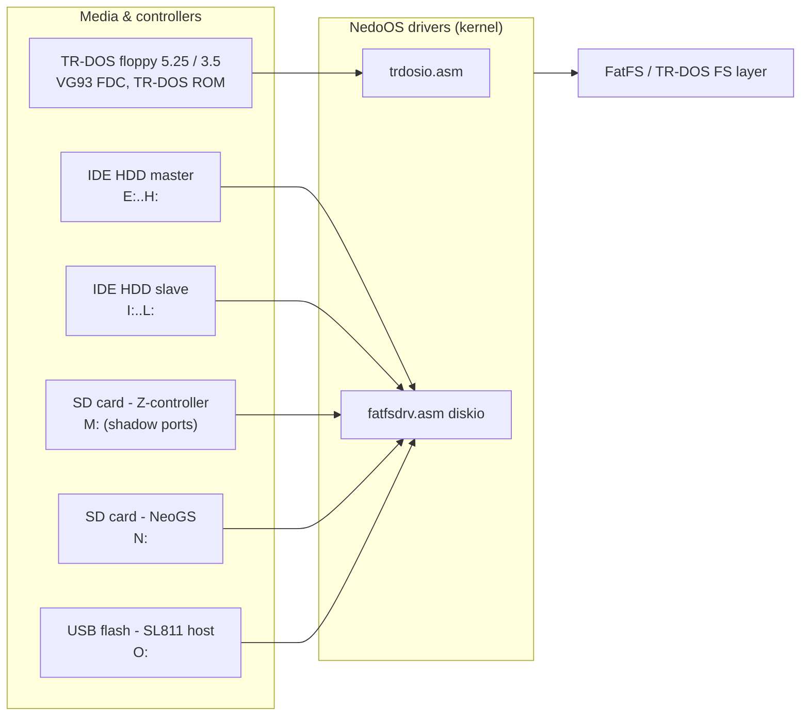

# Hardware Platforms & Peripherals

*Prev: [Goals & requirements](goals-and-requirements.md) · Next: [Glossary](glossary.md)*

NedoOS is compiled per platform. The compile-time switches live in the generated
file `_sdk/syssets.asm` (see the `syssets-*` targets in
[`NedoOS/src/Makefile`](../../NedoOS/src/Makefile)); platform identity also
selects memory port values and HDD register maps in
[`kernel/main.asm`](../../NedoOS/src/kernel/main.asm).

## Supported base platforms

| Config target | `atm=` | RAM pages | IDE scheme | Network (INETDRV) | PS/2 kbd | Deliverable |
|---|---|---|---|---|---|---|
| `atm2` / `atm2hd` | 2 | 64 (1 MB) | ATM IDE | none / 0x01 | no | `osatm2.trd`, `osatm2hd.$C` |
| `pe26` / `pe26sd` | 2 | 64 (1 MB) | ATM IDE | 0x01 (WIZnet) | no | `ospe26.trd`, `ospe26sd.$C` |
| `atm3` / `atm3hd` / `atm3sd` | 3 | 192 (3 MB) | NemoIDE | 0x01 (WIZnet) | no | `osatm3.trd`, `osatm3hd.$C`, `osatm3sd.$C` |
| `evolution` | 1 | 192 (3 MB) | NemoIDE | 0x01 (WIZnet) | yes | `osevo.$C` |

* `atm` also drives `memport*` values: on ATM2 the low-window ports use
  `0x3ff7/0x7ff7/0xbff7/0xfff7` with `pagexor=0x7f`; on ATM3/Evo
  `0x37f7/0x77f7/...` with `pagexor=0xff` (`main.asm` lines 18–45).
* `SYSDRV` selects the boot drive: `0` = floppy `A:`, `4` = HDD `E:`, `12` = SD `M:`.
* The Evolution build additionally requires ERS ROM ≥ 0.58.12 (checked at boot in
  `idle.asm`; failure prints a halt message).

## Memory banking hardware

All targets expose 16 KiB pages in the four Z80 windows
(`0x0000, 0x4000, 0x8000, 0xC000`) through memory-mapped configuration ports:

* **Window select ports** (`memport0000..memportc000`): `out (c),page` style
  16-bit port writes; the kernel wraps these behind the `SETPG4000/8000/C000`
  restarts for user code.
* **Low-page selector, port `0xFD`:** one byte decides whether the physical
  *system page* or the *task page* answers at `0x0000..0x3FFF` — the key
  mechanism that lets kernel trampolines work (see
  [memory map](../02-architecture/memory-map.md)).
* **`sys_npages`** fixes total RAM: 64 pages on ATM2/PE26, 192 pages on ATM3/Evo.
  With `TOPDOWNMEM` the system pages are allocated from the top of RAM instead of
  fixed low positions (`main.asm`, `pgtrdosfs=pagexor-(sys_npages-1)` etc.).

## Mass storage

* **IDE** — two register maps chosen by `NEMOIDE`: Nemo scheme
  (`0xF0/0xD0/0xB0/0x90/0x70/0x50/0x30/0x10...`) or ATM scheme
  (`0xFEEF/0xFECF/...`). Each drive supports up to 4 mounted partitions per
  master/slave position (letters E..H / I..L).
* **Z-controller SD** — bit-banged SPI via shadow ports; the recommended media
  for emulators (`sd.vhd` image, see
  [release images](../06-tools-and-build/release-images.md)).
* **NeoGS SD** — driven through the NeoGS/General Sound coprocessor interface
  (`ngssddrv.asm`, `portsngs.asm`).
* **USB flash** — SL811HS host controller driver (`sl811.asm`, ~44 KB, the
  largest single kernel driver); on WIZnet builds the SL811 is shared with the
  network card (ZXNETUSB).

## Video & input

* **Video modes** (via `OS_SETGFX`, CRT register `0xBD77`):
  `0` = EGA 320×200, 16 colours; `2` = multicolour 640×200; `3` = standard
  6912; `6` = hardware text 80×25. Bit 3 of the mode byte (+8) requests
  non-turbo mode on Evolution; +0x80 keeps the previous screen pages.
* **Palettes** — DDp (Diman’s digital palette) 4+4+4 bits, 16 colours × 2 bytes,
  programmed through ports `0xFF/0xFE/0xF6` (`setgfxpal_focus` in `syskrnl.asm`).
* **Two hardware screens** per visual task (`OS_SETSCREEN`) enable interlaced
  output for 512×192-class modes.
* **Keyboard** — standard Spectrum matrix; Evolution adds PS/2 (`ps2drv.asm`,
  `PS2KBD` flag). Ext/Tab+letter maps to control codes 1..26; Ext+number
  produces F1..F10.
* **Mouse** — Kempston mouse with wheel; position and three buttons returned by
  `OS_GETKEY` together with the key code.
* **Joystick** — Kempston, returned in `LX` by `OS_GETKEY`
  (`0bP2JFUDLR`, 1 = pressed).

## Sound hardware

| Device | Use | OS service |
|---|---|---|
| AY-3-8910 (×2 with TurboSound) | background PT2/PT3 music per task | `OS_SETMUSIC` |
| Covox / PWM DAC (port 0xFB family) | sampled PCM playback, blocking | `OS_PLAYCOVOX` |
| General Sound / NeoGS | MOD playback, sample synth | `modplay`, `ngsdec`, NeoGS SD |
| TurboSound FM | music in players | `player`, `pt` |

## Clock & other peripherals

* **RTC** — Mr.Gluk’s real-time clock schematic (CMOS), read/written through
  `OS_GETTIME/OS_SETTIME`; file timestamps use it. `atm2clock=1` selects the
  ATM2 variant wiring.
* **Network cards** — see [network stack](../03-kernel/network-stack.md):
  ZXNETUSB (W5300 + SL811 USB host) or an ESP8266 UART "coprocessor".
* **NVRAM / snapshot facilities** — `nmisvc` uses the NMI button to escape
  running snapshots (48K/128K SNA) and save state; see
  [applications overview](../05-applications/applications-overview.md).

## Emulator prerequisites

For development without iron, the project ships UnrealSpeccy presets
(`NedoOS/us/emul.ini`, `atm2.ini`, `dimkam.ini`) and ROM images
(`us/2006.ROM`, `us/zxevo_fe.rom`, `us/xbios137.rom`, TR-DOS ROM). SD/HDD images
are mounted as VHD/IMA files — full instructions in
[release images](../06-tools-and-build/release-images.md).

## Next

* [Glossary](glossary.md) — terminology used across these docs.
* [System architecture](../02-architecture/system-architecture.md) — how the
  software is layered on top of this hardware.
