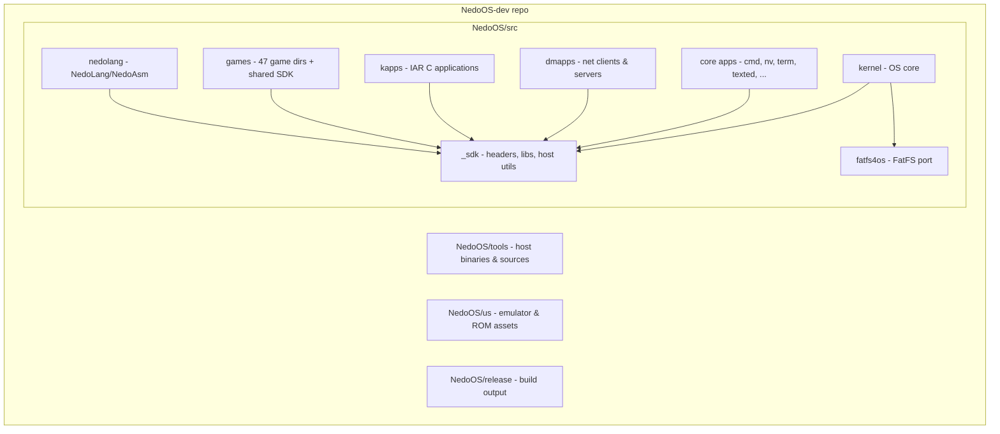

# NedoOS: Overview

*Parent: [Documentation hub](../README.md) · Next: [Goals & requirements](goals-and-requirements.md)*

Sources: [`nedoos.txt`](../../NedoOS/src/nedoos.txt) and
[`nedoos_en.md`](../../NedoOS/src/nedoos_en.md) (official descriptions),
[`src/Makefile`](../../NedoOS/src/Makefile) (what gets built), the kernel
tree [`src/kernel/`](../../NedoOS/src/kernel).

## What NedoOS is

**NedoOS** is a cooperative-multitasking operating system for Z80-based ZX Spectrum
compatible computers, written almost entirely in Z80 assembly language. It targets
the *extended* Spectrum hardware family — **ATM Turbo 2**, **ATM3**, **ZX Evolution**
and **Pentagon 2.666** — machines that add banked RAM (up to several megabytes),
hard-disk/SD/USB mass storage, enhanced video modes, PS/2 keyboards and Ethernet.

In one sentence: *NedoOS turns an 8-bit home computer into a CP/M-class (and beyond)
multitasking workstation with a UNIX-flavoured process/pipe model, FAT and TR-DOS
file systems, TCP/IP networking and a rich application stack.*

Key properties, taken directly from the code and
[`NedoOS/src/nedoos_en.md`](../../NedoOS/src/nedoos_en.md):

| Property | Value | Evidence |
|---|---|---|
| CPU | Z80 (3.5 MHz base, 14 MHz on ZX Evolution) | `DEVICE ZXSPECTRUM128` in sources |
| Multitasking | Up to **16 tasks**, interrupt-driven round-robin, 50 Hz frame | `MAXAPPS=16` in [`syskrnl.asm`](../../NedoOS/src/kernel/syskrnl.asm) |
| Memory per task | Full `0x0100..0xffff` user space, 16K windows switchable via OS calls | `PROGSTART=0x0100` in [`sysdefs.asm`](../../NedoOS/src/_sdk/sysdefs.asm) |
| Files | 8 files on FAT + 8 on TR-DOS + 8 pipes simultaneously | `MAXFILES=16`, `MAXPIPES=8` in [`sysbdos.asm`](../../NedoOS/src/kernel/sysbdos.asm) |
| File systems | FAT12/16/32 with LFN (FatFS), TR-DOS incl. segmented files | [`fatfsdrv.asm`](../../NedoOS/src/kernel/fatfsdrv.asm), [`trdosfs.asm`](../../NedoOS/src/kernel/trdosfs.asm) |
| Networking | TCP/UDP/ICMP over ZXNETUSB (WIZnet W5300) or ESP8266 UART | [`w5300.asm`](../../NedoOS/src/kernel/w5300.asm), [`espnet.asm`](../../NedoOS/src/kernel/espnet.asm) |
| API | CP/M 2.x + MSX-DOS compatible subset plus ~60 original `CMD_*` calls | [`sys_h.asm`](../../NedoOS/src/_sdk/sys_h.asm) |
| Binary format | Flat `.com` images loaded at `0x0100` (CP/M style) | `savebin "prog.com",PROGSTART,...` |

## What makes it interesting (design highlights)

1. **A kernel that hides in your page zero.** Every task gets a copy of a tiny
   *user kernel* ([`userkrnl.asm`](../../NedoOS/src/kernel/userkrnl.asm)) in its
   low 16K window. The CP/M-compatible restarts (`rst 0`, `call 0x0005`,
   `rst 0x08`, `rst 0x10`, `rst 0x18/20/28`) live there and bounce the machine
   into the real kernel by flipping the low-page mapping register (port `0xFD`).
2. **A scheduler paid for by the video frame.** There is no preemptive timer
   quantum: the 50 Hz interrupt *is* the scheduling tick. Each active task is
   guaranteed at most one slice per frame; `YIELD` hands the rest of a slice back.
3. **CP/M heritage, MSX-DOS extensions, homebrew spirit.** Legacy FCB calls
   coexist with handle-based calls, per-task current directories, pipes and a
   BSD-like socket API.
4. **Self-hosting ambition.** The project's stated goal is that one day NedoOS
   will assemble itself — hence the strict assembler dialect rules documented in
   [coding guidelines](../04-sdk/coding-guidelines.md).

## Scope of this documentation

This documentation set is **reverse-engineered**: it was derived from reading the
sources, not written by the original authors. It covers:

* goals, requirements and constraints ([next page](goals-and-requirements.md));
* the architecture: memory, processes, I/O, interrupts
  ([02-architecture](../02-architecture/system-architecture.md));
* kernel internals: boot, syscalls, file and network stacks ([03-kernel](../03-kernel/kernel-structure.md));
* the SDK as seen by an application developer ([04-sdk](../04-sdk/sdk-overview.md));
* the application portfolio shipped in-tree ([05-applications](../05-applications/applications-overview.md));
* host-side build tools and release production ([06-tools-and-build](../06-tools-and-build/build-system.md)).

## Reverse-engineering method & confidence

The approach used to build these documents:

1. **Read the entry points.** `nedoos_en.md` (official English manual) and
   `api_base.txt` / `api_net.txt` (official API docs, Russian) establish intent.
2. **Verify in code.** Every claim about behaviour was cross-checked against
   the corresponding source file (e.g. scheduler claims against
   `schedule:` in `syskrnl.asm`, build claims against `src/Makefile`).
3. **Trace the build.** Makefiles, `syssets-*` targets and batch scripts were
   used to reconstruct configuration and packaging flows.
4. **Mark uncertainty.** Where the code is ambiguous the text says so explicitly.

Confidence is *high* for API/memory/process/build topics (dense, verifiable code)
and *moderate* for per-application internals (some apps are huge, e.g.
`sysbdos.asm` is ~3.5k lines; application walkthroughs prioritize documented
behaviour over exhaustive code paths).

## Repository layout at a glance

A detailed file-by-file map is in [07-appendix/source-map.md](../07-appendix/source-map.md).

## See also

* [Goals, functional requirements & constraints](goals-and-requirements.md)
* [Hardware platforms](hardware-platforms.md)
* [System architecture](../02-architecture/system-architecture.md)
