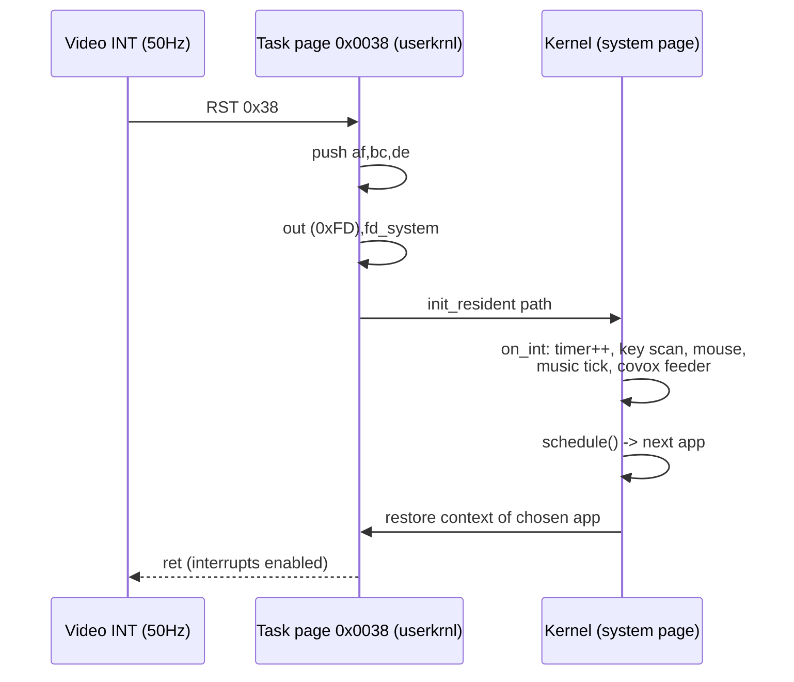
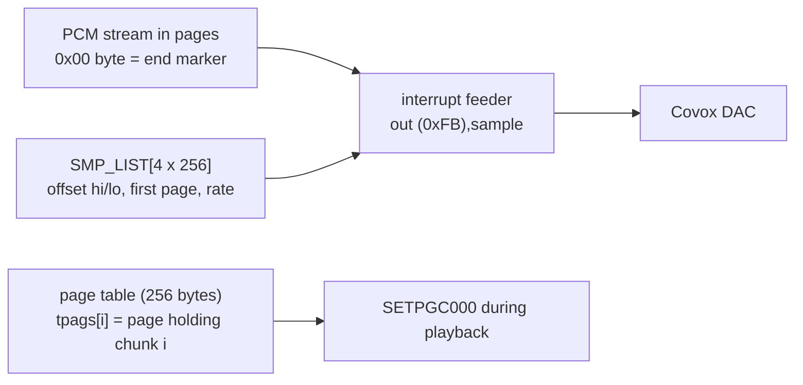

# Interrupts, Timing, Music & Sampled Sound

*Prev: [I/O & pipes](io-and-pipes.md) · Up: [Architecture](system-architecture.md)*

Sources: [`kernel/userkrnl.asm`](../../NedoOS/src/kernel/userkrnl.asm) (task-side
0x0038), [`kernel/syskrnl.asm`](../../NedoOS/src/kernel/syskrnl.asm)
(`sys_sysint`, `on_int` path), [`kernel/main.asm`](../../NedoOS/src/kernel/main.asm)
(music engine hooks, `sys_timer`), `OS_PLAYCOVOX` documentation in
[`_sdk/sys_h.asm`](../../NedoOS/src/_sdk/sys_h.asm), and the interrupt-capture
recipe in [`nedoos_en.md`](../../NedoOS/src/nedoos_en.md).

## The one and only interrupt

The machine runs in IM1: the Z80 takes `RST 0x38` every video frame (50 Hz on
PAL machines; 60 Hz variants simply run the same logic). NedoOS uses this
single interrupt as:

* scheduler tick (see [process model](process-model.md)),
* system timer (`sys_timer`, a 32-bit frame counter at system `0x0034`,
  readable via `OS_GETTIMER`),
* keyboard/mouse scan point,
* music and PCM feeder.

The exit protocol is carefully ordered (`nop; ei; out (c),d` in userkrnl) so
that the very first instruction after `ei` executes with the *task's* low page
already restored — closing the classic "interrupt between page switch" race.

## User-side interrupt capture

Programs may install their own handler (the manual documents the exact
protocol):

1. Replace the 3 bytes at `0x0038` with `jp my_handler`, saving the original
   `intjp` pointer found at `0x0038+3`.
2. `my_handler` must switch to a private stack, save registers, then `call
   oldimer` (the original jump) to let the kernel tick, then restore and
   return.
3. Rules: do not use `YIELD` from interrupt context (use `HALT`), and make OS
   calls either inside the handler or immediately after `HALT`.
4. Simpler alternative for music only: `OS_SETMUSIC` — the kernel plays your
   PT3 module in the background and no handler hacking is needed.

## The system timer

* `sys_timer`: 4 bytes at system page `0x0034`, incremented once per frame.
* `OS_GETTIMER` returns it in `DEHL`. Typical uses: benchmarking (the browser
  shows render times), timeouts, animation.
* The scheduler's `lasttime` stamps (one byte) are derived from the same
  counter — see the fairness rule in [process model](process-model.md).

## Keyboard & mouse inside the interrupt

`on_int` (kernel) does the per-frame input work:

* Scans the keyboard matrix (or receives PS/2 packets on Evolution builds via
  `ps2drv.asm`).
* Maintains the key FIFO for the focused task, mapping physical keys to the
  internal codes: `ext*` (Tab-combos → ASCII 1..26), `ss*` (Symbol Shift row),
  `cs*` (Caps Shift combos), language recoding (RU ШВЕРТЫ layout with
  two-press digraphs `ja=я`, `jo=ё`, …; CP866 output, CP1125 for Ukrainian).
* Samples the Kempston mouse (position, 3 buttons, wheel in `L` bits 7..4).
* Applies CapsLock / layout-switch sticky state (`Caps Shift+1`).

## Background music: `OS_SETMUSIC`

| Aspect | Detail |
|---|---|
| Format | Pro Tracker 3 modules (PT3; PT2 legacy), TurboSound-aware on 2-chip machines |
| Addressing | `HL` = module address in `0x4000..0xffff` of caller space, `A` = page for `0x8000/0xC000` windows; `HL=0` stops |
| Scheduling | one tick per frame inside the kernel interrupt, on a dedicated stack (`INTMUZSTACK=0x3e00`) |
| Per task | each task has its own music slot; the focused/last-set module is audible |

## Sampled sound: `OS_PLAYCOVOX`

A blocking PCM player for the Covox DAC (port `0xFB`), able to stream samples
larger than 16K using a **page table**:

Contract highlights (from `sys_h.asm`):

* `HL` = stream start (`0xC000..0xFFFF` window), values unsigned, `0x00`
  terminates (encode silence as `0x01`);
* `DE` = page table address; chunks continue across pages sequentially;
* `HX` = rate delay: `18` ≈ 11 kHz, `7` ≈ 22 kHz, `1` ≈ 44 kHz (real range ≈ 8–44 kHz);
* interrupts stay enabled but `YIELD` is forbidden during playback;
* the helper toolchain (`evoresc -samplelist`) prepares `SMP_LIST` + `tpags`
  from WAV files — see [games SDK](../05-applications/games.md).

## Timing constraints & etiquette

| Rule | Why |
|---|---|
| Never busy-loop a frame without `YIELD` | other tasks lose their slice for that frame only — but responsiveness suffers |
| Keep SP ≥ `0x3b00` around OS calls | the kernel banks `0x4000` for its stacks |
| Don't touch ports `0xFD`, memory ports, `0xBD77` directly | the kernel mirrors state (`curpg*`, gfxmode) and will fight you |
| `HALT` is allowed; `YIELD` inside your own interrupt handler is not | the handler runs on the kernel's context, not a schedulable one |

## Real-time behaviour summary

| Event | Frequency | Jitter |
|---|---|---|
| Frame interrupt | 50 (60) Hz | none (hardware) |
| Task switch | ≤ 1 per task per frame | bounded by switch cost ≈ 1800–3946 T |
| Music tick | 50 Hz | inside interrupt, jitter-free |
| Covox sample | 8–44 kHz | divider-based inside interrupt |
| `sys_timer` | 50 Hz | exact |

## See also

* [Process model](process-model.md) for the scheduling consequences.
* [Memory map](memory-map.md) for the stacks used inside the interrupt.
* [Multimedia apps](../05-applications/multimedia.md) for players that build
  on these services.
