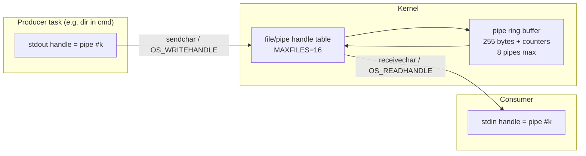

# I/O Model: Pipes, stdio, Terminals

*Prev: [Process model](process-model.md) · Next: [Interrupts & timing](interrupt-and-timing.md)*

Sources: pipe machinery in [`kernel/sysbdos.asm`](../../NedoOS/src/kernel/sysbdos.asm)
(`MAXPIPES=8`, `PIPEBUF_SZ=255`), the SDK stdio in
[`_sdk/stdio.asm`](../../NedoOS/src/_sdk/stdio.asm), and the terminal servers
[`term/term.asm`](../../NedoOS/src/term/term.asm),
[`netterm/term.asm`](../../NedoOS/src/netterm/term.asm).

## Design

NedoOS gives every task three standard handles — `stdin`, `stdout`, `stderr` —
stored in the app descriptor and manageable with `OS_SETSTDINOUT` /
`OS_GETSTDINOUT`. The most common handle type is a **pipe**: a 255-byte ring
buffer owned by the kernel. This mirrors Unix file descriptors closely enough
for a CP/M-class machine, and enables:

* `term.com` — a *local* terminal that renders a program's output into its own
  graphics screen and feeds keystrokes back;
* `netterm` — the same idea over a Telnet session (TCP port 2323);
* shell redirection and pipelines (`dir > file.txt`, `dir | more.com`).



## Handle numbering & volumes

From `sysbdos.asm`:

| Constant | Value | Meaning |
|---|---|---|
| `MAXFILES` | 16 | total open descriptors (files + pipes) per system |
| `vol_pipe` | 25 (`'Z'`) | volume number embedded in pipe handles |
| `vol_trdos` | 4 (`'A'..'D'`) | TR-DOS volumes |
| `PIPEADD80` | `0x80` | handle bit distinguishing pipes |
| `TRDOSADD40` | `0x40` | handle bit distinguishing TR-DOS files |
| `MAXPIPES` / `PIPEBUF_SZ` | 8 / 255 | pipe count and capacity |

Pipe handles are therefore recognizable by their high bits, letting generic
handle code (`OS_READHANDLE`/`OS_WRITEHANDLE`) dispatch to pipe, FAT or TR-DOS
backends transparently.

## The SDK stdio library

[`stdio.asm`](../../NedoOS/src/_sdk/stdio.asm) is the portable façade that most
command-line apps link. Exported calls (documented at the top of the file):

| Call | Direction | Notes |
|---|---|---|
| `initstdio` | — | caches stdin/stdout handles and terminal height via `CMD_GETSTDINOUT` |
| `sendchar` / `PRCHAR_` | out | one byte to stdout (pipe-aware) |
| `sendchars` | out | buffer of `HL` bytes |
| `receivechar` / `GETCHAR_` | in | one byte, `CY`=EOF/error |
| `receivechars` | in | `BC` = actually read |
| `getkey` / `GETKEY_`, `yieldgetkeyloop` | in | read *key codes* from stdin |
| `setxy`, `setx`, `setcolor`, `scrolldown/up`, `clearterm` | out | terminal-oriented primitives forwarded to the console or interpreted by `term` |

Programs written against these calls work identically on:

1. the raw kernel console (no `term`, handles point to console);
2. a local `term` (ANSI-ish stream interpreted into its hires/text window);
3. a remote Telnet client via `netterm`.

That single property is why dozens of NedoOS utilities (cmd, ping, tar, unrar…)
are usable over the network with zero changes.

## Terminals

### `term` — local console server

Behaviour (from the source and manual):

* On start it calls `OS_HIDEFROMPARENT`, takes a hires (mode 2) or text (mode 6)
  screen via `OS_SETGFX`, releases the screen pages it does not need.
* It creates the stdin/stdout pipes, then launches the requested program (by
  default the shell chain `cmd.com autoexec.bat`) wired to those pipes.
* Renders the byte stream as a VT-100-class terminal: cursor addressing,
  colours, scrolling; 33 lines × 80 columns in the 6-pixel hires font
  (`CHRHGT=6`) or 25 lines in text mode.
* Mouse wheel scrolls back; a click in the top-left corner saves the visible
  text to `pasta.txt`, bottom-left pastes it back (80 chars) — the "clipboard".
* The kernel's *idle* task starts the first `term`, so a fresh boot lands in a
  terminal running `autoexec.bat`.

### `netterm` — Telnet server

* Listens on TCP port **2323**; every incoming connection gets a terminal
  session with its own pipes, so several remote shells can coexist with the
  local one.
* Speaks enough Telnet/VT-100 for standard clients (`PuTTY` profile: VT-100,
  local echo off, line editing off, BackSpace=Ctrl-H).
* Uses the same `codes.thk` translation table idea as `term` for control
  sequences.

### `telnet` — Telnet client, `scrnet` — screen over HTTP

* `telnet url[:port]` connects out and bridges the session to local stdio.
* `scrnet` (port 2324) publishes the current screen over HTTP — remote
  monitoring without a full terminal.

## Redirection in the shell

`cmd` implements a mini shell grammar (details in
[shell & terminals](../05-applications/shell-and-terminals.md)):

```
dir > listing.txt        # stdout to file
type file.txt | more     # pipe stdout of type to stdin of more
more < file.txt          # stdin from file
start prog.com           # run detached (no WAITPID)
```

The shell performs the plumbing by creating a pipe or opening the file and
passing handles to the child through its app descriptor (`OS_SETSTDINOUT` on
the new task before `OS_RUNAPP`).

## Reading input without focus

* `OS_GETKEY` returns keys only to the focused task (others see `NOKEY`,
  mouse zeroed) — this is what keeps background tasks from stealing keystrokes.
* Unfocused tasks that need raw key state (games with their own scanners, music
  players) use `OS_GETKEYMATRIX`; it returns the physical matrix regardless of
  focus (the manual's recommended replacement for reading port `0xFE`
  directly).
* `OS_PUTKEY` injects keys into the focused task's queue; parameter `D`
  distinguishes letters (0), control codes (1) and the synthetic
  focus-switch event (2).

## Latency & buffering notes

* Pipe capacity is one byte short of 256; producers bigger than that must
  expect the consumer to drain — `sendchars` yields while waiting, so a blocked
  writer does not wedge the machine.
* `term` keeps a 256-byte stdin buffer (`STDINBUF_SZ`) and a read-ahead paste
  buffer (`READPASTABUF_SZ=80`).
* Console output from a non-focused task is discarded by `OS_PRCHAR`; tasks
  that must log while unfocused should write to pipes/files instead.

## See also

* [Process model](process-model.md) — where the handles live.
* [Shell & terminals](../05-applications/shell-and-terminals.md) — user-level
  view of the same machinery.
* [API catalog](../04-sdk/api-catalog.md) — `CMD_SETSTDINOUT` and friends.
