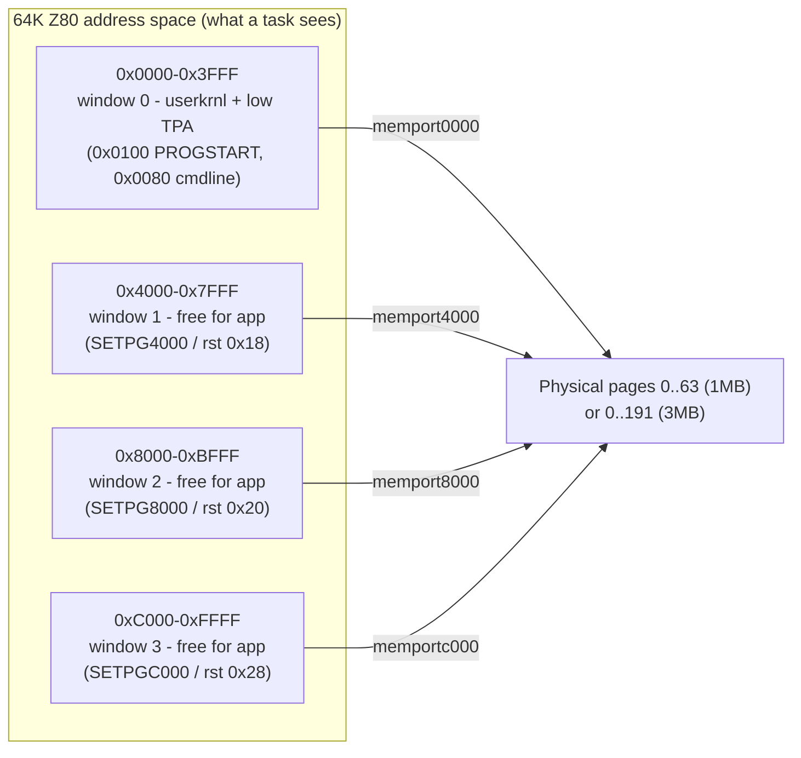
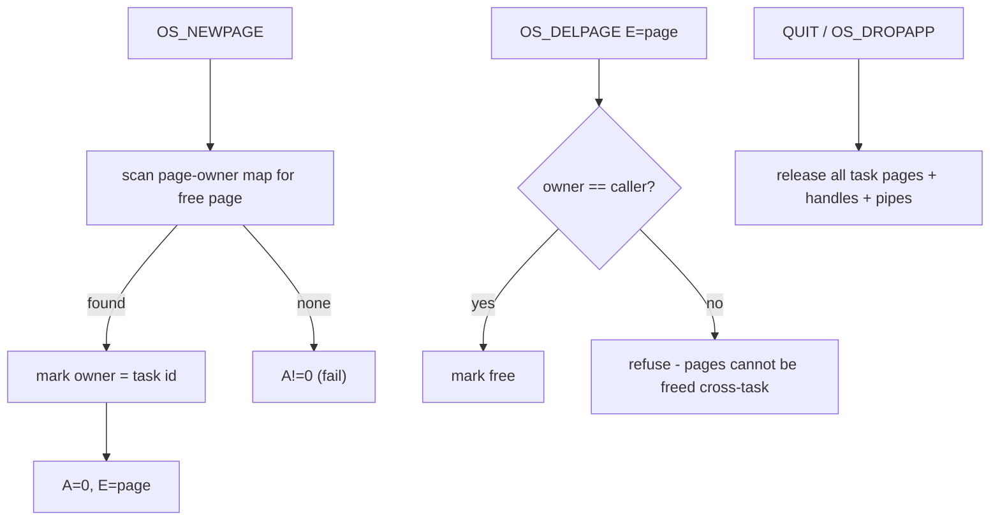

# Memory Map & Banked Memory Management

*Prev: [System architecture](system-architecture.md) · Next: [Process model](process-model.md)*

Sources: [`kernel/main.asm`](../../NedoOS/src/kernel/main.asm) (page constants,
stacks, resident layout), [`kernel/syskrnl.asm`](../../NedoOS/src/kernel/syskrnl.asm)
(app table), [`kernel/userkrnl.asm`](../../NedoOS/src/kernel/userkrnl.asm)
(page zero layout), [`_sdk/sysdefs.asm`](../../NedoOS/src/_sdk/sysdefs.asm)
(user-visible constants).

## The Z80 address space, four windows



Every 16K window independently maps any physical page. The kernel exposes the
three upper windows to tasks through one-byte restarts (`rst 0x18/0x20/0x28`)
that also record the current page in `curpg16k / curpg32klow / curpg32khigh`
(at `0x0044 / 0x004a / 0x0050` of the task page, so the OS can restore them at
every switch). The low window is switchable only via `OS_SETMAINPAGE` because
it must always contain a valid trampoline (`userkrnl`).

## Page zero of a task (userkrnl)

From `userkrnl.asm`, the layout a program can rely on:

| Address | Content |
|---|---|
| `0x0000` | `jp sys_quit` — the `QUIT` restart (task exit) |
| `0x0005` | BDOS gateway: `ld a,fd_system; out (0xFD),a` + jump to kernel `callbdos` |
| `0x0009` | `sys_getchar` gateway (also `rst 0x08` path) |
| `0x0010` | `fastprchar` gateway — `rst 0x10` prints char in A |
| `0x0017` | `user_scr0_low` — screen page shadow bytes |
| `0x0018 / 0x0020 / 0x0028` | `setpg4000 / setpg8000 / setpgc000` restarts (update `curpg*`, `out (c),a`) |
| `0x0035..0x0037` | `user_scr0_high`, `user_scr1_low`, `user_scr1_high` |
| `0x0038` | interrupt entry: `push af/bc/de`, `out (0xFD),fd_system`, jumps into kernel `init_resident` |
| `0x0044 / 0x004a / 0x0050` | `curpg16k / curpg32klow / curpg32khigh` — current page mirrors |
| `0x0080` | `COMMANDLINE` — byte length + up to 127 chars |
| `0x0100` | `PROGSTART` — program entry, initial SP just under `0x0000` |

The `0xFD` port is what makes this safe: the byte written (`fd_system=0x57` vs
`fd_user=0x47`) selects whether the *system* page or the *task* page answers in
`0x0000..0x3FFF`. A task therefore literally jumps into the kernel by rewriting
its own low window.

## System (kernel) pages

Constants from `main.asm` (shown for `pagexor=0xff`, i.e. ATM3/Evo; ATM2 uses
`pagexor=0x7f`, and `TOPDOWNMEM` relocates them to the top of RAM):

| Page | Name | Role |
|---|---|---|
| `pagexor-1` | `pgscr0_0` | screen 0, attributes/bitmap halves pair 1 |
| `pagexor-3` / `pagexor-5` | `pgscr1_0` / `pgscr0_1` | screen 1 pair and screen 0 pair 2 |
| `pagexor-7` | `pgscr1_1` | screen 1, second half |
| `pagexor-4` | `pgkillable` | scratch page, guaranteed present even on 128K machines (INTSTACK2 lives in it) |
| `pagexor-8` | `pgtrdosfs` | resident segment at `0x6000` + TR-DOS catalog/buffers |
| `pagexor-9` | `pgfatfs` | FatFS data page (C code linked at `0x4000`) |
| `pagexor-10` | `pgsys` | kernel system page (mapped at `0x0000`) |
| `pagexor-11` | `pgfatfs2` | FatFS work area / structures |

Anything else is allocatable to tasks by `OS_NEWPAGE` (owner recorded, queryable
via `OS_GETPAGEOWNER`; `0xff` marks system-owned, `0` free).

### Layout inside the system page (`pgsys` at address `0x0000`)

| Range | Content (from `syskrnl.asm`) |
|---|---|
| `0x0000` | `sys_quit` entry |
| `0x0005` | `callbdos` (+ `callbdos_mutex` byte `0xc0` at `0x0004`) |
| `0x0009` | `sys_getchar` |
| `0x000f` | `sys_farcall` placeholder (far call planned at RST `0x30`) |
| `0x0010` | `fastprchar` |
| `0x0018/20/28` | sys-side `setpg*` |
| `0x0034` | `sys_timer` (4 bytes, 50 Hz) |
| `0x0038` | `sys_sysint` — kernel-side interrupt entry |
| `0x0100` | stack area for CP/M-style calls |
| above | `safestack`, then the **app table**: 16 × `app` descriptors |
| end | BDOS handler code, then jump table `tbdoscmds` |

### Resident segment in `pgtrdosfs` (addresses, any window it is mapped to)

From `main.asm`:

| Address | Content |
|---|---|
| `0x6000` | `resident` code + unpacked TR-DOS FS state |
| `0x6300` | `trdos_catbuf` — TR-DOS catalog cache |
| `0x6c00` | `trdos_sectorbuf` — sector buffer |
| `0x6d00` | `trdos_fcbbuf` — 8 × FCB (0x200 each) |
| `0x5f00` | `INTSTACK2` (interrupt work stack) and `TRDOSSTACK` below it |

## Stacks

| Stack | Location | Owner |
|---|---|---|
| User stack | starts at `0x0000` growing down (wraps to `0xffff`); may be relocated ≥ `0x3b00` | task |
| `SYSMINSTACK` | `0x3b00` | minimum SP a task must honor before BDOS calls |
| `BDOSSTACK` | `0x4000` | kernel, while servicing BDOS (page-independent) |
| `INTSTACK2` | `0x5f00` in `pgtrdosfs` | interrupt handler working stack |
| `TRDOSSTACK` | `0x5f00-96` | TR-DOS ROM calls (avoids cassette vector clash) |
| `INTMUZSTACK` | `0x3e00` | music engine inside interrupts |
| `safestack` (×16) | 18 bytes per app, after the app table | saved Z80 context |

The rule that makes this work: *a task’s SP must be ≥ `0x3b00` whenever it calls
the OS*, because the kernel may bank the `0x4000` window for its own stack.

## Page allocation policy



* `OS_GETMAINPAGES` returns the four window pages of the caller; the same info
  for another task comes from `OS_GETAPPMAINPAGES` (used by loaders).
* `OS_GETPAGEOWNER` distinguishes free (`0`), system (`0xff`) and task ids.
* `TOPDOWNMEM` builds place system pages at `pagexor-(sys_npages-1)` … i.e. the
  top of RAM, maximizing contiguous low free memory for big apps (e.g. games).
* Screen pages: `OS_SETGFX` (without +0x80) reassigns the task’s screen page
  pair; `user_scr0/1_*` shadows let the SDK switch them fast.

## Data structures kept per task (app descriptor)

From the `STRUCT app` in `syskrnl.asm` (summarized; see
[process model](process-model.md) for semantics):

```
flags, id, parentid, mainpg      ; state and identity
stdin, stdout, stderr            ; pipe/file handles
lasttime, border, screen, gfxmode, gfxkeep
scr0low, scr0high, scr1low, scr1high   ; private screen pages
childresult (word), textcuraddr (word), curcolor
dta (word), vol, dircluster (dword)
dir (DIR_sz)                     ; directory scan state
bdosstack, pal (32 bytes)
```

The app table is 16 consecutive descriptors placed right after a shared
`safestack`; `schedule` walks it cyclically (index arithmetic only — no linked
lists, to stay cheap in interrupt context).

## See also

* [Process model](process-model.md) — how these pages get used at runtime.
* [Kernel structure](../03-kernel/kernel-structure.md) — build-time origin of
  these images (`initcode.c`, `syscode.c.mlz`).
* [SDK overview](../04-sdk/sdk-overview.md) — the macros tasks use to bank.
