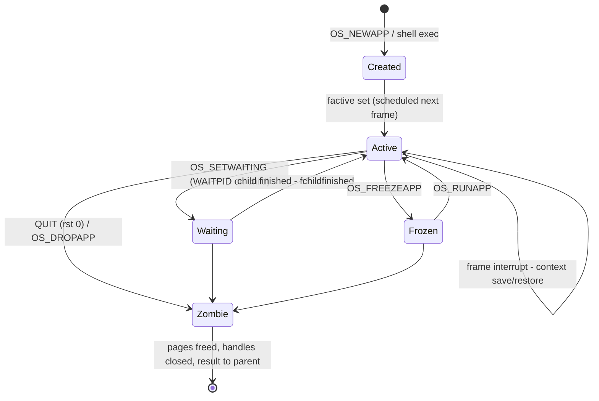
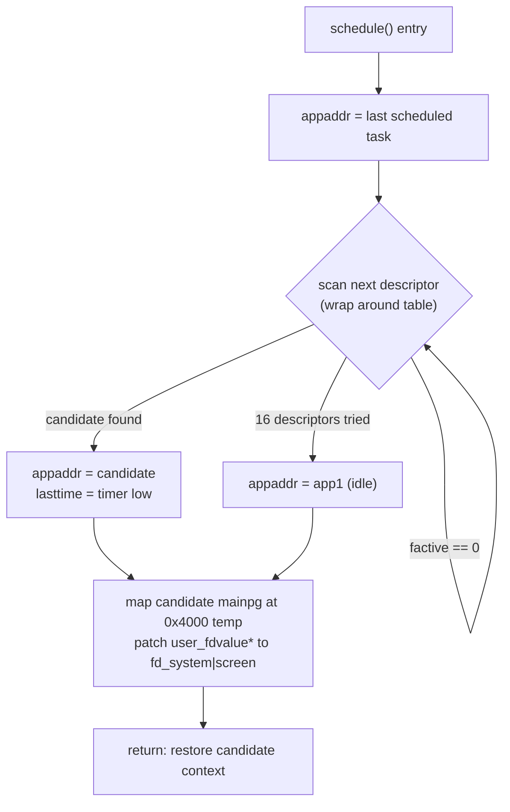
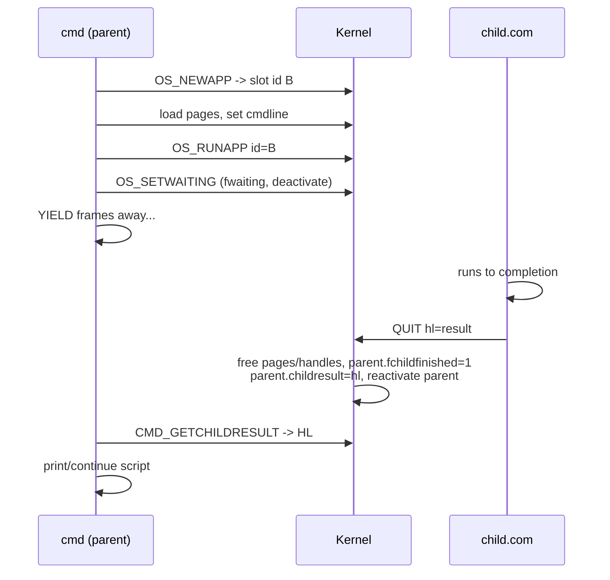

# Process Model: Tasks, Focus, Scheduler

*Prev: [Memory map](memory-map.md) · Next: [I/O & pipes](io-and-pipes.md)*

Primary sources: [`kernel/syskrnl.asm`](../../NedoOS/src/kernel/syskrnl.asm)
(app descriptor, scheduler, context switch), [`kernel/idle.asm`](../../NedoOS/src/kernel/idle.asm)
(idle task), `cmd.asm` (process creation from the shell), and the `WAITPID`
protocol in [`_sdk/sys_h.asm`](../../NedoOS/src/_sdk/sys_h.asm).

## The app descriptor

Each of the up-to-16 tasks is described by one `STRUCT app` record in the system
page (full field list in [memory map](memory-map.md)). The fields most relevant
to behaviour:

| Field | Meaning |
|---|---|
| `flags` | bit 0 `factive` — scheduled; bit 1 `fchildfinished`; bit 5 `fgfx` — may take focus; bit 7 `fwaiting` — blocked on a child |
| `id` / `parentid` | task identity and creator (0 = self/none) |
| `mainpg` | physical page mapped at `0x0000` (contains the task's userkrnl) |
| `lasttime` | low byte of `sys_timer` at the task's last slice — the anti-starvation stamp |
| `screen`, `gfxmode`, `scr0/1*` | visual state: selected hardware screen, CRT mode, private screen pages |
| `childresult` | exit code written by a dying child, read by `CMD_GETCHILDRESULT` |
| `vol`, `dircluster`, `dir` | per-task current drive/directory and scan state |
| `stdin/stdout/stderr` | handles (usually pipes) — see [I/O & pipes](io-and-pipes.md) |

## Task lifecycle

* **Creation.** The shell (or any task) uses `OS_NEWAPP` to obtain a disabled
  task slot with four allocated pages, then copies the `.com` image and the
  trampoline in, writes the command line at `0x0080`, and calls `OS_RUNAPP`.
  `cmd` treats `.com` execution as *blocking* (it `WAITPID`s) unless the
  `start` command or `.bat` `start` semantics are used.
* **Exit.** `QUIT` (restart 0) with `HL` = result code. The kernel closes the
  task's files/pipes (except TR-DOS files it may leave for safety), frees its
  pages, records `childresult`, sets `fchildfinished` on the parent, and
  reschedules.
* **Detachment.** `OS_HIDEFROMPARENT` removes the parent link so the shell does
  not block on a GUI program (`term`, `nv`, games use this).

## The scheduler

There is no ready queue. `schedule:` in `syskrnl.asm` is called once per frame
interrupt and at every `YIELD`:

Properties (verified against the code):

* **Fairness, not priority.** Every `factive` task receives at most one slice
  per 20 ms frame; `lasttime` prevents a second slice in the same frame.
* **The idle task is task #1** (`app1`), created at boot. When nothing is
  runnable, idle runs: it draws the logo at boot, launches `term.com` once, and
  then spins polling the C+M+D hotkey (spawn `cmd.com` when no active tasks).
* **YIELD** (`CMD_YIELD`) immediately enters the switch path (`sys_intq_yield`),
  donating the rest of the slice. **YIELDKEEP** marks the task as eligible to be
  picked again within the same frame — required by `term`/`stdio` re-entrancy.
* **Waiting** (`OS_SETWAITING`) clears `factive`; the flag is restored when the
  awaited child sets `fchildfinished`. A `WAITPID` is the macro sequence
  `OS_SETWAITING; YIELD; CMD_GETCHILDRESULT`.

## Context switch mechanics

On every interrupt (from *any* task's `0x0038`):

1. The task-side trampoline pushes `af, bc, de`, writes `fd_system` to port
   `0xFD` (system page now at `0x0000`) and jumps into the kernel
   (`init_resident` / `sys_intgo`).
2. The kernel saves the *complete* register set (`af' , bc', de', hl', ix, iy,
   hl, sp` — 18 bytes) into the interrupted task's `safestack` slot.
3. `on_int` services the frame: music tick, `sys_timer` increment, Covox
   feeder, keyboard scan (matrix/PS/2), mouse sampling, key queue maintenance.
4. `schedule()` selects the next task (diagram above).
5. The kernel maps that task's `mainpg`, restores its `curpg*` window pages and
   screen paging byte, then pops the context from its `safestack` and returns —
   interrupts re-enabled — into the middle of the newly scheduled task.

Cost note from the sources: ≈3946 T-states worst case (about 11% of a frame at
3.5 MHz), ~1800 T-states typical.

## Focus & visual tasks

* A task becomes *visual* by calling `OS_SETGFX` (which also switches the CRT
  mode and hands it the screen). The `fgfx` flag is set; the caller
  automatically receives focus.
* Exactly one task holds focus (`focusappaddr`). Focus gates: `OS_GETKEY`
  delivery, `OS_PRCHAR` console output, `OS_GETPAL` reads, palette/border
  restoration at switches (`setgfxpal_focus`).
* **Symbol Shift+Enter** (PS/2: Right Shift+Enter) cycles focus among visual
  tasks; the newly focused task receives synthetic `key_redraw` (31) so it can
  repaint.
* Frozen (`OS_FREEZEAPP`) tasks are forced non-visual while frozen.
* `OS_GETGFX` reports the current mode, focus task id, active screen and the
  four screen pages — enough for tools like `scrshot` to dump the screen
  safely.

## Parent/child coordination example

Escape hatch: a child may call `OS_HIDEFROMPARENT` right after start (as
`term` does) so the parent stops waiting and the child outlives the shell that
launched it.

## Process-related API summary

| Call | Purpose |
|---|---|
| `OS_NEWAPP` / `OS_RUNAPP` | create disabled task / activate it |
| `OS_FREEZEAPP` | freeze a task (keeps memory) |
| `OS_CHECKPID` | is this child still alive? |
| `OS_DROPAPP` | terminate another task by id |
| `QUIT` | terminate self with result in HL |
| `OS_SETWAITING` + `YIELD` + `OS_GETCHILDRESULT` | join a child |
| `OS_HIDEFROMPARENT` | detach from parent |
| `YIELD` / `YIELDKEEP` | donate slice / donate but allow same-frame resume |
| `OS_SETGFX` / `OS_GETGFX` / `OS_SETSCREEN` | visual-task management |
| `OS_PUTKEY` (D=2) | synthesize the focus-switch hotkey |

Full register contracts: [API catalog](../04-sdk/api-catalog.md).

## See also

* [Interrupts & timing](interrupt-and-timing.md) — where the tick comes from.
* [I/O & pipes](io-and-pipes.md) — stdin/stdout plumbing between tasks.
* [Shell](../05-applications/shell-and-terminals.md) — how users actually start
  processes and scripts.
