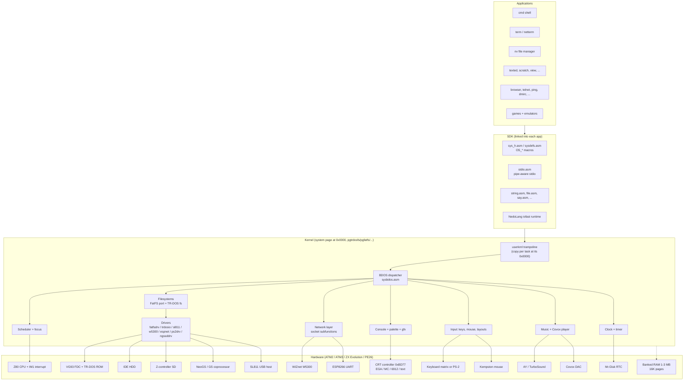
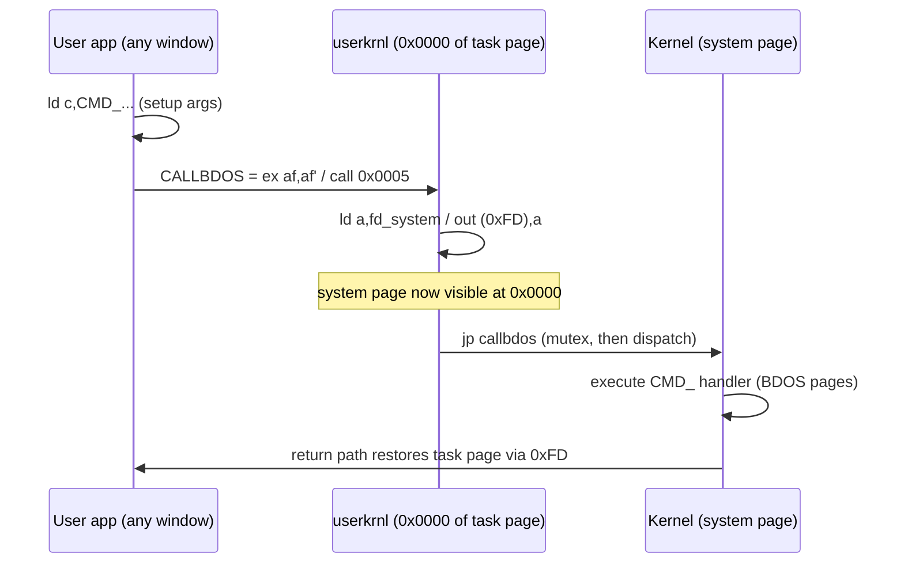
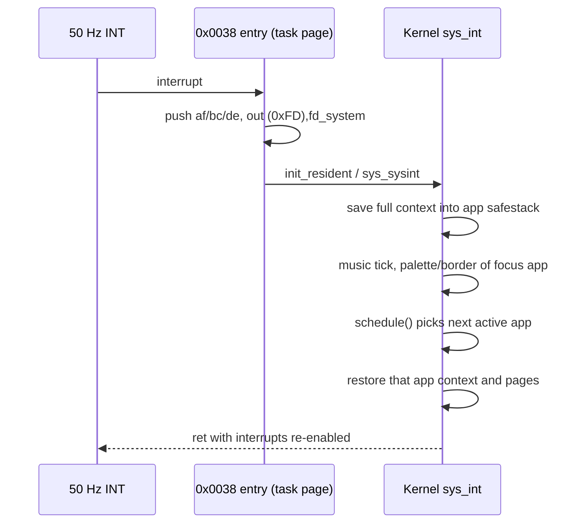
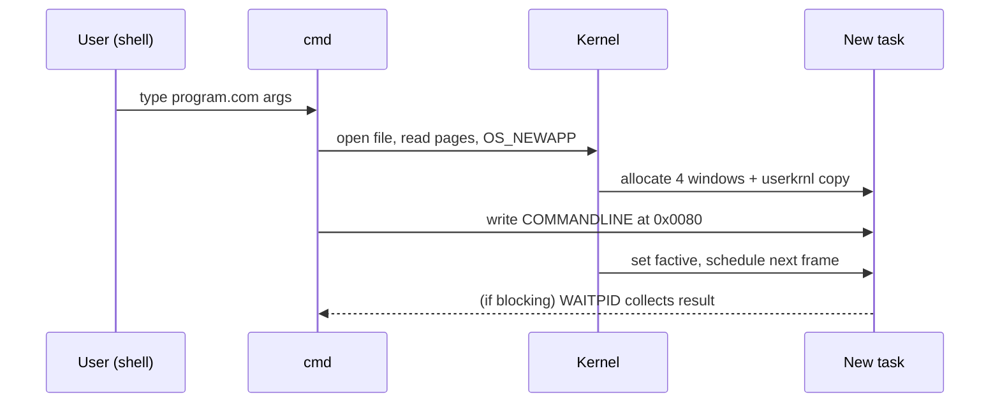

# System Architecture

*Up: [Documentation hub](../README.md) · Next: [Memory map](memory-map.md)*

This page gives the layered, bird’s-eye view of NedoOS. Each layer is then
expanded in dedicated pages: [memory](memory-map.md),
[processes](process-model.md), [I/O](io-and-pipes.md),
[interrupts](interrupt-and-timing.md), and the
[kernel internals](../03-kernel/kernel-structure.md).

## Layered view

## The three memory roles

Understanding NedoOS starts with realizing that the *same* physical address
space plays three roles simultaneously:

1. **User space** — each running task perceives `0x0100..0xffff` as its own
   machine (three freely bankable windows plus the trampoline window).
2. **Kernel space** — the system page mapped at `0x0000..0x3fff` (and scratch
   pages) holds the real kernel; it is *pulled in* through port `0xFD` writes
   performed by the trampoline before any OS call.
3. **Shared hardware state** — CRT controller, palette ports, FDC, IDE, SD,
   network and sound are reachable from the kernel only (user code gets them
   only through syscalls).

Details and exact page numbers: [memory map](memory-map.md).

## Control flow patterns

### OS call (user → kernel → user)

### Task switch on frame interrupt

### Program launch

## Subsystem responsibilities

| Subsystem | Kernel files | Notes |
|---|---|---|
| Trampoline & restarts | `userkrnl.asm` | per-task copy; QUIT/BDOS/GETKEY/PRCHAR/SETPG |
| Scheduler, app table, focus | `syskrnl.asm` | `MAXAPPS=16` descriptors, `safestack` contexts |
| BDOS dispatcher | `sysbdos.asm`, table tail of `main.asm` | function-number → handler jump table |
| FAT stack | `fatfs4os/ff.c` + `fatfsdrv.asm` | C core cross-compiled (SDCC), drivers in asm |
| TR-DOS stack | `trdosfs.asm`, `trdosio.asm` | segmented-file support, R/I/A error UI |
| Block drivers | `fatfsdrv.asm`, `ngssddrv.asm`, `sl811.asm`, `xt_drv.asm` | IDE (2 schemes), SD (2 kinds), USB |
| Network | `w5300.asm`, `w5300ini.asm`, `espnet.asm`, `espnet_bss.asm` | selected by `INETDRV` |
| Input | `syskey1.asm`, `syskey2.asm`, `ps2drv.asm` | matrix + PS/2, RU/EN recoding |
| Console/gfx | parts of `sysbdos.asm`, `syskrnl.asm` | char out, colours, scroll, gfx modes, palettes |
| Sound | `main.asm` (music), Covox player | PT3 engine, PCM with page table |
| Idle & boot app | `idle.asm`, `main.asm` init part | mounts drives, logo, launches `term` |

## Key architectural decisions (and why)

1. **Trampoline instead of trap instructions.** Z80 lacks a cheap supervisor
   call; `rst` targets live in banked page zero, which each task owns. The
   trampoline plus the `0xFD` port write gives a 100% userspace-resolvable call
   path with kernel entry cost of ~3 instructions.
2. **Scheduling by frame interrupt, not by preemption.** Without an MMU or a
   free programmable timer, the video frame interrupt is the only dependable
   clock; the design accepts one-slice-per-frame fairness and asks long-running
   tasks to `YIELD`.
3. **CP/M + MSX-DOS layered API.** Reusing CP/M function numbers (0x05–0x22)
   and MSX-DOS handle calls (0x43–0x5e) buys source compatibility with a large
   retro software corpus, while 0xc6+ invents modern services (pages, pipes,
   gfx, net).
4. **FatFS as C island.** The FAT core is compiled C (`fatfs4os`) linked at
   `0x4000` of a dedicated kernel page — trading a rare language boundary for a
   battle-tested FS implementation.
5. **Everything per-task.** Current directory, DTA, palette, border, screen
   pages, stdin/stdout/stderr — all live in the app descriptor, enabling clean
   focus switching and independent consoles (`term` per shell).
6. **Compile-time hardware abstraction.** One source tree, many machines:
   `syssets.asm` + `atm=` conditionals; no runtime driver database — an
   appropriate trade for ROM-less disk boot and small size.

## What NedoOS deliberately is not

* Not Unix: no per-task address isolation, no permissions, one user.
* Not preemptive: a task that never yields still hogs CPU between interrupts
  of a frame — the kernel reclaims control only at the frame boundary.
* Not a multi-console GUI: focus moves between *visual tasks*, but there is
  exactly one visible screen and one input stream at a time.
* Not portable off the Z80: page sizes, ports and restarts are baked in.

## Next steps

* [Memory map](memory-map.md) — exact pages, windows, stacks, buffers.
* [Process model](process-model.md) — the app descriptor and scheduler in depth.
* [Kernel structure & boot](../03-kernel/kernel-structure.md) — how it all starts.
