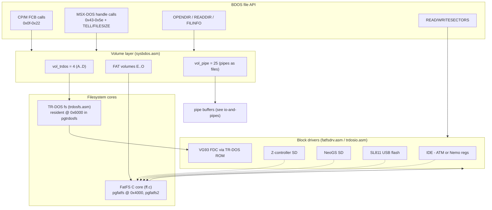
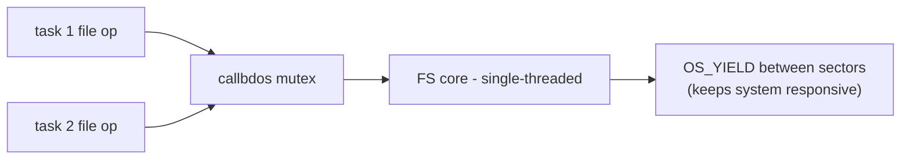

# Filesystem Stack: FAT (FatFS), TR-DOS, Volumes

*Prev: [Syscall interface](syscall-interface.md) · Next: [Network stack](network-stack.md)*

Sources: [`fatfs4os/`](../../NedoOS/src/fatfs4os) (ChaN FatFS port + SDCC
linkage), [`kernel/fatfsdrv.asm`](../../NedoOS/src/kernel/fatfsdrv.asm)
(diskio drivers), [`kernel/fatfs_h.asm`](../../NedoOS/src/kernel/fatfs_h.asm)
(structure glue), [`kernel/trdosfs.asm`](../../NedoOS/src/kernel/trdosfs.asm) +
[`trdosio.asm`](../../NedoOS/src/kernel/trdosio.asm) (TR-DOS), and the volume
constants at the top of [`kernel/sysbdos.asm`](../../NedoOS/src/kernel/sysbdos.asm).

## Layering

## Volume model

| Letter(s) | Backend | Notes |
|---|---|---|
| `A..D` | TR-DOS floppy | volume ids `0..3`; internal code `vol_trdos=4` marks "TR-DOS family" |
| `E..H` | IDE master partitions | up to 4 partitions, mounted by `hddfdisk`-created table |
| `I..L` | IDE slave partitions | |
| `M` | SD card, Z-controller | recommended system disk for emulators |
| `N` | SD card, NeoGS | |
| `O` | USB flash (SL811) | also used by ZXNETUSB's USB half |
| *(internal)* | pipes | `vol_pipe=25`, handles with `PIPEADD80` bit |

* Each **task** keeps its own current volume (`app.vol`) and directory
  (`app.dircluster` for FAT; the TR-DOS catalog is global but access is
  mutexed) — `cd` in one shell does not affect another.
* `OS_MOUNT` (re)scans a drive; `idle` calls it for all configured drives at
  boot; `OS_SETDRV` selects a drive, reporting not-mounted volumes.

## FAT subtree

### The C island

* [`ff.c`](../../NedoOS/src/fatfs4os/ff.c), `ff.h`, `ffconf.h`, `integer.h`
  are ChaN's FatFS (EVAL license per the manual's credit section), compiled
  with **SDCC** into `fatfs.raw`, then `incbin`-ed into the kernel at
  `0x4000` of the FAT data page.
* `mylib.asm` / `savelij.asm` provide the asm↔C glue: calling conventions,
  `diskio` upcalls, and the iofast fast-path read used by loaders.
* `ffconf.h` selects: FAT12/16/32, LFN enabled (buffered in `pgfatfs2`),
  code page 866-compatible, 2 volumes max mounted simultaneously
  (`NVOLUMES`-era constant), timestamps wired to the Mr.Gluk RTC via
  `OS_GET/SETTIME`.
* The port is **not built by the Linux Makefiles** at present (license
  question noted in [`README.linux`](../../NedoOS/src/README.linux)); release
  images use the prebuilt `fatfs.raw`.

### diskio drivers (`fatfsdrv.asm`)

Implements `disk_status/disk_initialize/disk_read/disk_write` for:

1. **IDE** in either register dialect — Nemo (`0xF0/0xD0/0xB0/0x90/0x70/0x50/0x30/0x10/0x11`)
   or ATM (`0xFEEF/0xFECF/0xFEAF/0xFE8F/0xFE6F/0xFE4F/0xFE2F/0xFE0F/0xFF0F`),
   with CHS and LBA paths (`hddupr` ultra-PIO mode handling);
2. **Z-controller SD** — bit-banged SPI on shadow ports;
3. **NeoGS SD** — commands through the GS coprocessor port protocol
   (`portsngs.asm`, `ngssddrv.asm`, firmware `ngssd.bin` installed by
   `ngsinst.asm`);
4. **SL811 USB** — bulk-only mass storage via `sl811.asm`; the SL811 detect
   code is shared with the network stack (`device_states`, port `0xAB` probing).

### What the FAT layer provides through BDOS

Handle-based open/create/close/read/write/seek/tell/size, rename/move with
full destination path, delete, mkdir, opendir/readdir with `FILINFO`
(8.3 + long name, 64-byte `DIRMAXFILENAME64`), file info & timestamps
(`CMD_GETFILINFO`, `CMD_GET/SETFILETIME`), and per-task CWD strings via
`CMD_GETPATH` (drive-prefixed, up to 256 bytes).

## TR-DOS subtree

* **Catalog cache** — the floppy catalog is cached at `trdos_catbuf` in the
  resident segment; `trdos_MAXFILES=8` FCB slots at `trdos_fcbbuf`.
* **Segmented files** — NedoOS implements the TR-DOS *sequential access file
  standard*: files longer than what fits one catalog entry continue in chained
  segments, giving arbitrary-size files on a TR-DOS volume (a feature the
  original TR-DOS 5.x ROM lacked).
* **I/O path** — `trdosio.asm` drives the VG93 through the TR-DOS ROM routines
  (running on `TRDOSSTACK` to avoid the ROM's cassette-vector assumptions),
  switching the ROM page in only for the call duration.
* **Error UX** — read/write errors paint the border red and prompt
  **R**etry / **I**gnore / **Abort**; "ignore" substitutes a zeroed sector so
  the caller still gets data.
* Files may be used with both FCB and handle APIs; TR-DOS handles carry the
  `TRDOSADD40` bit. TR-DOS files opened by a dying task are intentionally
  *not* force-closed (commented safety choice in `sysbdos.asm`).

## Path & name handling

* Dot-names (`NAME.EXT`, 8.3) parsed by `CMD_PARSEFNAME` into CP/M 11-byte
  form; `'?'` wildcards work in FCB searches (`FSEARCHFIRST/NEXT`), with the
  NedoOS twist that the template must be supplied on every `NEXT` call.
* Paths: `d:/dir/sub/file` with `/` separators; `..` supported; relative to
  the task CWD. `MAXPATH_sz=256`.
* Long names on FAT volumes round-trip through `FILINFO.LNAME`; the shell and
  `nv` display them when present.

## Concurrency rules

* The BDOS mutex serializes filesystem entry — FatFS state is *not*
  re-entrant.
* Sector loops call `YIELD` so a large copy does not starve the UI.
* Directory enumeration state lives *per task* (`app.dir`), which is why two
  shells can list two directories concurrently — a bug fixed as early as
  13.11.2018 per the changelog.

## Raw sector access

`OS_READSECTORS` / `OS_WRITESECTORS` (`B`=drive letter, `DE`=buffer,
`IX:HL`=32-bit sector, `A`=count) bypass filesystems — used by `mktrd`,
`rdtrd`, `wrtrd`, `gettrd`, `hddfdisk` and `dmm` for image work.

## See also

* [API catalog](../04-sdk/api-catalog.md) for exact call contracts.
* [File management apps](../05-applications/file-management.md) for the tools
  built on this stack.
* [Memory map](../02-architecture/memory-map.md) for the pages involved.
