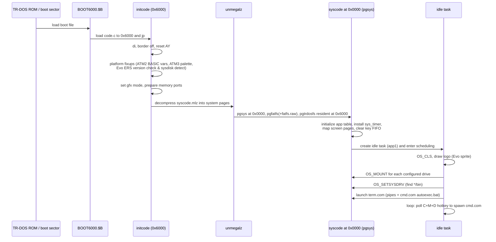

# Kernel Structure & Boot Sequence

*Up: [Documentation hub](../README.md) · Next: [Syscall interface](syscall-interface.md)*

Sources: [`kernel/main.asm`](../../NedoOS/src/kernel/main.asm) (master file),
[`kernel/Makefile`](../../NedoOS/src/kernel/Makefile) (image assembly),
[`kernel/idle.asm`](../../NedoOS/src/kernel/idle.asm) (boot task),
[`kernel/unmegalz.asm`](../../NedoOS/src/kernel/unmegalz.asm) (decompressor),
[`kernel/hobeta.asm`](../../NedoOS/src/kernel/hobeta.asm) (boot-file header),
and the top-level [`src/Makefile`](../../NedoOS/src/Makefile) `trd` target.

## Source inventory

| File | Size | Role |
|---|---|---|
| `main.asm` | 1478 lines | master: hardware constants, init code, includes, BDOS jump table, image layout |
| `syskrnl.asm` | 1393 | system side of kernel: restarts, app table, scheduler, interrupt entries |
| `sysbdos.asm` | 3462 | BDOS handlers: files, pipes, console, gfx, time, misc |
| `syskey1.asm` / `syskey2.asm` | 70/450 | keyboard matrix scan / key recoding & layouts |
| `trdosfs.asm` / `trdosio.asm` | 676/940 | TR-DOS filesystem / TR-DOS disk I/O + error UI |
| `fatfsdrv.asm` | 909 | diskio drivers: IDE (2 schemes), Z-ctrl SD, NeoGS SD, SL811 USB |
| `fatfs_h.asm` | ~430 | FatFS structure offsets & glue constants |
| `w5300.asm` / `w5300ini.asm` | 500/380 | WIZnet W5300 socket driver / init & DHCP-ish setup |
| `espnet.asm` / `espnet_bss.asm` | 240/110 | ESP8266 UART coprocessor driver + state |
| `ps2drv.asm` | 300 | PS/2 keyboard/mouse packets (Evolution) |
| `ngssddrv.asm`, `portsngs.asm`, `ngsinst.asm` | 100–200 | NeoGS SD card access |
| `sl811.asm` | 1500 | SL811 USB host mass storage |
| `xt_drv.asm` | 250 | XT keyboard variant bits |
| `idle.asm` | 313 | the boot/idle task |
| `userkrnl.asm` | 90 | per-task trampoline (assembled at `0x0000`) |
| `unmegalz.asm` | 90 | MegaLZ decompressor for the boot image |
| `hobeta.asm` | 5 | Hobeta header generator for `nedoos.$C` |

Build outputs (see [build system](../06-tools-and-build/build-system.md)):

```
main.asm --sjasmplus--> initcode.c   (from page COMPILEPG_INIT, org 0x6000)
                      \- syscode.c   (from pages COMPILEPG_SYS0/SYS1)
syscode.c --mhmt -mlz--> syscode.c.mlz
cat initcode.c syscode.c.mlz > code.c
code.c + hobeta.asm --> nedoos.$C        (boot file for HDD/SD configs)
trd target: test.trd + BOOT6000.$B + code.c at 0x6000
```

## Boot sequence



Platform-specific fixups visible at the top of `main.asm`:

* **ATM2** — restores tape BASIC variables to `0x5C00`, uses `atm2clock=1` RTC
  wiring;
* **ATM3** — selects palette register value `0x20` (D5=444 palette) on port
  `0xBF`;
* **Evolution (atm=1)** — verifies ERS ROM version ≥ 0.58.12 via RST 0x08
  interface, scans the partition table for the system device (floppy/HDD/SD),
  configures the initial disk access geometry; failure halts with a
  downloadable-ROM hint printed by `idle`.

## The init image layout (what lands where)

| Artifact | Destination | Notes |
|---|---|---|
| `initcode.c` | `0x6000` | platform setup + call to unpacker; also holds `EFF7VALUE` turbo flags |
| `syscode.c.mlz` | appended | compressed kernel body |
| decompressed `syscode` | `pgsys` at `0x0000`, `pgfatfs` pages | includes `fatfs.raw` binary (C core) incbinned at `0x4000` |
| `userkrnl` | replicated into every task page 0 | assembled with `disp 0x0000` inside main.asm |
| `866toatm` table | end of syscode | CP866 → ATM font recoding table for console output |

## The idle task (`idle.asm`)

The first and permanent task:

1. Sets stack `0x4000`, clears screen (colour 7), verifies ERS (Evo).
2. Releases the 3 non-essential pages it was created with, keeps its main page.
3. Draws the logo sprite (Evo build — `spr_cat` pixel art loop).
4. `mountdrives`: probes configured volumes (floppy/IDE/SD/USB) and mounts
   them; on Evolution reads the boot device from ERS.
5. `OS_SETSYSDRV`: selects the system drive (the one containing `bin/`),
   honouring the `SYSDRV` build constant (0=floppy A, 4=HDD E, 12=SD M).
6. Launches `term.com`; because idle never set `OS_SETGFX`, it remains a text
   task with no CRT ownership.
7. Forever: checks the C+M+D chord; when no active tasks exist, spawns
   `cmd.com` for a fresh shell.

## Error & robustness paths

* **BDOS mutex** — byte at system `0x0004` (`0xc0` opcode trick); BDOS entry
  refuses re-entry from the same context, protecting the FS stacks.
* **TR-DOS error UI** — on floppy errors the border flashes red and the user
  gets R (retry) / I (ignore sector) / A (abort) — implemented in `trdosio.asm`
  and surfaced to whatever task was reading.
* **`syscodesz` check** — at assembly time the kernel size is displayed and
  must stay below `SYSMINSTACK`; the build fails loudly if the kernel outgrows
  its page budget.
* **Watchdog-ish behaviour** — none; the frame interrupt always re-enters the
  scheduler, so even a crashed task cannot lock the machine unless it disabled
  interrupts.

## Configuration switches affecting the kernel

From `syssets.asm` (generated per target, see
[build system](../06-tools-and-build/build-system.md)):

| Switch | Values | Effect in kernel |
|---|---|---|
| `atm` | 1/2/3 | memory port map, `pagexor`, platform fixups |
| `sys_npages` | 64/192 | RAM size, system page placement (`TOPDOWNMEM`) |
| `NEMOIDE` | 0/1 | IDE register scheme (ATM vs Nemo) |
| `SYSDRV` | 0/4/12 | default system drive probe order |
| `INETDRV` | 0/1/2 | none / WIZnet+SL811 / ESP8266 |
| `PS2KBD` | 0/1 | PS/2 keyboard & mouse driver |
| `atm2clock` | 0/1 | RTC wiring variant |
| `USETOPDOWNMEM` | def | system pages at top of RAM |

## Next

* [Syscall interface](syscall-interface.md) — how user code reaches all this.
* [Filesystem stack](filesystem-stack.md) and [network stack](network-stack.md)
  for the two biggest subsystems.
* [Build system](../06-tools-and-build/build-system.md) to reproduce the images.
