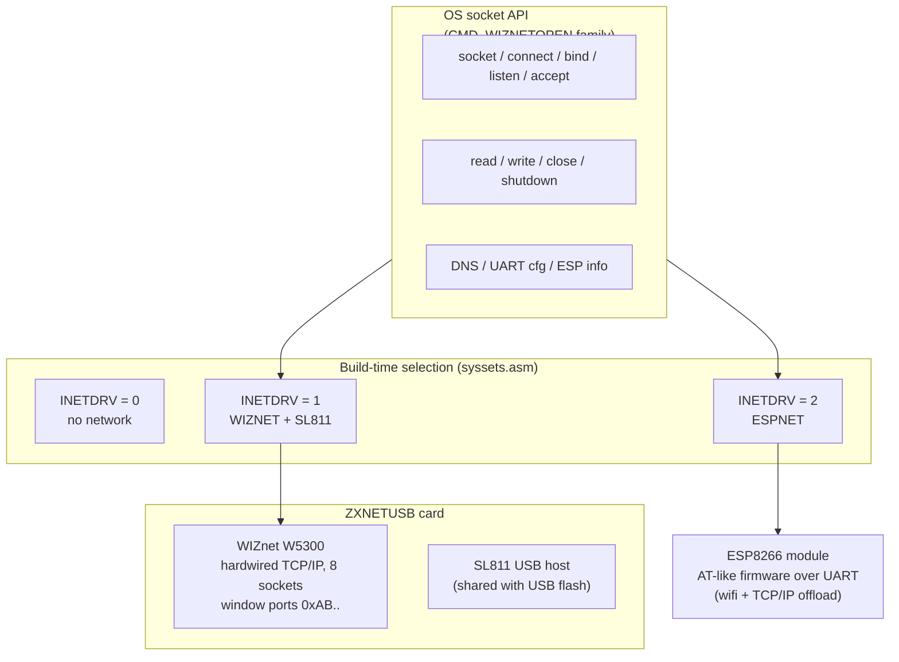

# Network Stack: WIZnet W5300, ZXNETUSB, ESP8266

*Prev: [Filesystem stack](filesystem-stack.md) · Up: [Kernel internals](kernel-structure.md)*

Sources: [`kernel/w5300.asm`](../../NedoOS/src/kernel/w5300.asm) +
[`w5300ini.asm`](../../NedoOS/src/kernel/w5300ini.asm) (WIZnet driver),
[`kernel/espnet.asm`](../../NedoOS/src/kernel/espnet.asm) +
[`espnet_bss.asm`](../../NedoOS/src/kernel/espnet_bss.asm) (ESP driver),
[`_sdk/espnet.asm`](../../NedoOS/src/_sdk/espnet.asm) +
[`_sdk/espnet_h.asm`](../../NedoOS/src/_sdk/espnet_h.asm) (user-side ESP
client), [`_sdk/api_net.txt`](../../NedoOS/src/_sdk/api_net.txt) (API spec),
[`net.ini`](../../NedoOS/src/net.ini) (configuration), and the `INETDRV`
dispatch visible at the head of
[`kernel/sysbdos.asm`](../../NedoOS/src/kernel/sysbdos.asm).

## Hardware backends



Both backends expose the *same* BSD-flavoured API, selected by `INETDRV` at
assembly time; `sys_h.asm` even rewrites the `OS_NET*` macros to call the
user-side `esp_*` library when `ESPNET` is defined, so applications compile
unchanged.

## The socket API

Entry point: `CMD_WIZNETOPEN` with a subfunction number in `L`:

| `L` | Macro | Contract |
|---|---|---|
| 1 | `OS_NETSOCKET` | `D`=AF (2=inet), `E`=type (1 TCP, 2 ICMP, 3 UDP) → `L`=socket or error |
| 2 | `OS_NETSHUTDOWN` | `A`=socket, `E`=0 full / 1 tx-only close → `L` |
| 3 | `OS_NETCONNECT` | `A`=socket, `DE`→`sockaddr_in` → `L` |
| 4 | `OS_ACCEPT` | `A`=listening socket → `HL` new socket |
| 5 | `OS_BIND` | `A`=socket, `DE`→`sockaddr_in` |
| 6 | `OS_LISTEN` | `A`=socket |
| 8 | `OS_GETDNS` | `DE`→4-byte buffer for DNS server IP |
| 9 | `OS_SETUART` | `DE`→20-byte UART config (ESP builds) |
| 0x0a | `OS_GETUART` | read UART config back |
| 0x0b | `OS_GETINFO` | `DE`→53-byte ESP INFO (wifi state, RSSI, IP, SSID) |
| — | `OS_WIZNETREAD` (`CMD_WIZNETREAD`) | TCP: `A`=sock, `DE`=buf, `HL`=len; UDP/ICMP: `IX`=buf, `DE`→sockaddr → `HL`=count |
| — | `OS_WIZNETWRITE` (`CMD_WIZNETWRITE`) | mirror of read |
| — | `OS_WIZNETCLOSE` (`CMD_WIZNETCLOSE`) | `A`=socket |

Conventions (from `api_net.txt`):

* Success/failure signalled by `L` (or `HL`) being negative — then `A` holds
  the errno.
* Sockets are 8-bit handles; ephemeral source ports are auto-assigned in
  49152..65535.
* `sockaddr_in` is 15 bytes: `sin_family` (byte, AF_INET=2), `sin_port`
  (big-endian word), `sin_addr` (4 bytes, network order), 8 bytes pad.
* Non-blocking friendly: `ERR_EAGAIN` is returned when the operation would
  block — the canonical loop is `retry: OS_YIELD; jr retry` (documented
  `close_wait` example).
* errno table mirrors BSD: `ERR_EAGAIN 35`, `ERR_NOTSOCK 38`, `ERR_AFNOSUPPORT 47`,
  `ERR_CONNRESET 54`, `ERR_NOTCONN 57`, etc.

## W5300 driver notes

* Registers are reached through a paged I/O window based at `0x00AB`
  (`WIZ_REGAD_PORT 0x81AB`, `WIZ_CFG_PORT 0x82AB`); socket registers
  (`WIZ_S_MR/CR/SSR/PORTR/DIPR/PROTO/FSR/RX...`) are addressed per-socket with
  stride 8 (`WIZ_SOCK0_HNDL`).
* `w5300ini.asm` performs chip init, reads/applies `net.ini` (MAC, hostname,
  IP/mask/gateway or `DHCP 1`), and prepares DNS.
* ICMP sockets are synthesized in Z80 code on top of raw IP where the chip
  does not provide it (`ping` builds on this).
* The SL811 USB host on the same card is serviced by `sl811.asm`; port
  `0xAB` probing distinguishes card presence (`disk_status` code path).

## ESP8266 backend notes

* The ESP runs a companion firmware ("espnet") that presents an AT-like
  command protocol over UART; the Z80 driver (`espnet.asm`) serializes
  commands with a busy-lock (`espk_busy_try`) so concurrent tasks do not
  interleave frames — note the two nolock subfunctions (9/0x0a) used for
  configuration.
* Socket semantics are mapped onto the ESP's connection handles; DNS and DHCP
  run on the module.
* User-side alternative: `_sdk/espnet.asm` implements the same calls
  *in the application* (macro redirection in `sys_h.asm`), useful when the
  kernel is built without ESP support but an app still wants networking via
  `OS_ESPINIT`.
* `wizcfg` (dmapps) writes `net.ini`; `espcfg` (kapps) is the IAR-C
  configurator with live INFO display.

## Configuration file `net.ini`

```ini
MAC=02:02:6A:6A:3B:3B      # used unless DHCP
NAME=Speccy
IP=192.168.1.177
MASK=255.255.255.0
GW=192.168.1.1
DHCP 1                     # when set, IP/MASK/GW come from DHCP
```

Parsed at kernel init (W5300 builds) or fed to the ESP (ESPNET builds);
`myip` and `time -i` display the resulting configuration; `scrnet` picks the
backend via `/ini/network.ini`.

## Networking applications built on the stack

| App | Protocol | Role |
|---|---|---|
| `ping` | ICMP echo | reachability test |
| `browser` (NedoBrowser) | HTTP/1.0, HTTPS-via-proxy | web browser (see [network apps](../05-applications/network-apps.md)) |
| `wget` | HTTP | downloader |
| `telnet` | TCP 23 | telnet client |
| `netterm` | TCP 2323 | telnet *server* to pipes (see [I/O](../02-architecture/io-and-pipes.md)) |
| `scrnet` | HTTP :2324 | screen publisher |
| `dmirc` / `dmftp` | IRC / FTP | chat / file transfer clients |
| `3ws` | HTTP :80 | web server sharing the system disk |
| `settime` (`time`) | NTP | clock sync |
| `myip` | — | show effective IP config |
| `zxart-radio` (kapps) | HTTP streaming | music/radio client |

## Performance & etiquette

* The W5300 offloads TCP/IP — Z80 code moves payload only; realistic
  throughput is bounded by the 8-bit bus window and busy-wait I/O.
* Always `YIELD` in retry loops (`ERR_EAGAIN`), otherwise other tasks starve.
* Long transfers should chunk reads/writes so the frame interrupt can run the
  scheduler between chunks (all in-tree apps do).
* UDP/ICMP reads return the sender address in the supplied `sockaddr_in` —
  the basis for `ping`'s echo matching.

## Historical / experimental

* `aynet/` documents an AY-port-based networking experiment (`proto.txt`,
  `yad` tool) — not part of the supported stack.
* `kapps/enet`, `kapps/cuart`, `kapps/svnesp` explore ESP and UART helpers in
  C via the IAR toolchain.

## See also

* [API catalog](../04-sdk/api-catalog.md) — socket call contracts.
* [Network applications](../05-applications/network-apps.md) — the consumers.
* [kapps (IAR C)](../05-applications/applications-overview.md) — C-level
  networking helpers.
