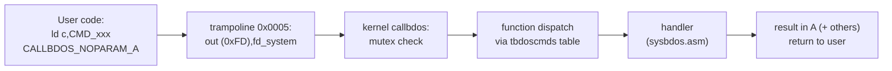
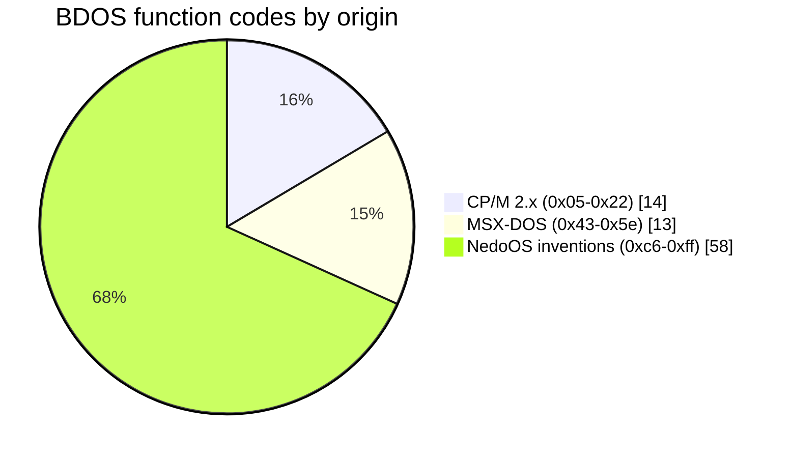

# Syscall Interface: RST Vectors & BDOS Dispatch

*Prev: [Kernel structure](kernel-structure.md) · Next: [Filesystem stack](filesystem-stack.md)*

Sources: [`_sdk/sys_h.asm`](../../NedoOS/src/_sdk/sys_h.asm) (macros + calling
conventions), [`_sdk/sysdefs.asm`](../../NedoOS/src/_sdk/sysdefs.asm) (function
numbers), the jump table at the end of
[`kernel/main.asm`](../../NedoOS/src/kernel/main.asm) (`tbdoscmds`), and
`callbdos`/`sys_farcall` in [`kernel/syskrnl.asm`](../../NedoOS/src/kernel/syskrnl.asm).

## Two entry mechanisms

### 1. Restart vectors (hot path)

One-byte calls living in the trampoline page (and mirrored by the kernel):

| RST | Macro | Purpose | Register contract |
|---|---|---|---|
| `0x00` | `QUIT` | terminate task | `HL` = result code |
| `0x08` | `OS_GETKEY` | read key + mouse + joystick | out: `A` key w/ lang, `BC` key w/o lang, `DE` mouse (y,x), `L` buttons+wheel, `LX` Kempston, `NZ` = no focus |
| `0x10` | `OS_PRCHAR` | print char to console | `A` = char; **spoils all registers** |
| `0x18` | `SETPG4000` | page → `0x4000` | `A` = page; spoils `BC` |
| `0x20` | `SETPG8000` | page → `0x8000` | `A` = page; spoils `BC` |
| `0x28` | `SETPGC000` | page → `0xC000` | `A` = page; spoils `BC` |
| `0x30` | *(planned)* far call | — |
| `0x38` | interrupt | frame entry | — |

### 2. BDOS call at `0x0005` (everything else)



* `CALLBDOS` (with `A` parameter, e.g. socket calls) wraps with `ex af,af'` so
  the caller's `A` survives; `CALLBDOS_NOPARAM_A` is the plain form. The SDK
  forbids calling these directly — always use the `OS_*` macros.
* Registers are **not** saved by the kernel on BDOS calls (documented rule);
  only the documented outputs are valid.
* The dispatcher uses a table of `dw handler` entries indexed by the `C`
  function code (visible in the tail of `main.asm`: `tbdoscmds`), so unused
  numbers can point at a stub returning an error.

## Function number allocation



| Range | Origin | Examples |
|---|---|---|
| `0x05..0x22` | CP/M 2.x | `CMD_PRCHAR 0x05`, `CMD_FOPEN 0x0f`, `CMD_FREAD 0x14`, `CMD_SETDTA 0x1a`, `CMD_RNDRD/WR 0x21/22` |
| `0x43..0x5e` | MSX-DOS | `CMD_OPENHANDLE 0x43`, `CMD_READHANDLE 0x48`, `CMD_DELETE 0x4d`, `CMD_RENAME 0x4e`, `CMD_CHDIR 0x5a`, `CMD_GETPATH 0x5e` |
| `0xc6..0xff` | NedoOS | `CMD_PUTKEY 0xc6`, `CMD_PLAYCOVOX 0xd4`, `CMD_SETMUSIC 0xd5`, `CMD_YIELD 0xf2`, `CMD_SETGFX 0xf9`, `CMD_YIELDKEEP 0xff` |

The complete table with contracts is in the
[API catalog](../04-sdk/api-catalog.md); numbers are defined once in
`sysdefs.asm`.

## Compatibility deviations (documented)

The API docs (`api_base.txt`, comments in `sys_h.asm`) call out deliberate
differences — important when porting CP/M or MSX-DOS code:

| Function | Deviation |
|---|---|
| `OS_FSEARCHNEXT` | **not CP/M compatible**: the FCB template must be passed every call (no global search state) |
| `OS_FREAD` | returns *actual byte count* in A (CP/M semantics differ) |
| `OS_FDEL` | deprecated — use `OS_DELETE` |
| `OS_SEEKHANDLE` | offset always relative to file start (no method byte); use `OS_TELLHANDLE` for position |
| `OS_GETPATH` | buffer 256 bytes (MSX-DOS: 64); returns with drive prefix |
| `OS_RENAME` | new name must include drive/path (MSX-DOS: bare name) |
| `OS_PARSEFNAME` | result flag in `B`, not carry |
| `OS_FSEARCHFIRST` | directory remark = no error; hidden/system files skipped; no date stamps in S1 |
| `OS_SETDRV` | returns `A != 0` when the volume is not mounted |

## Error conventions

* Most calls return `A = 0` on success (`OR A / JP NZ,error` idiom).
* FAT-backed calls return FatFS `FRESULT` codes (`0..18`, e.g. `4` no file,
  `8` exists) — see `CMD_RENAME` documentation in `sys_h.asm` for the full list.
* Socket calls return negative `HL` (i.e. `L` with bit 7 set) plus BSD errno in
  `A` (see [network stack](network-stack.md)).
* Key queue overflow from `OS_PUTKEY` returns `A = 1`.

## Kernel-side anatomy of one call (`CMD_CLS` example)

```mermaid
sequenceDiagram
    participant App
    participant UK as trampoline 0x0005
    participant CB as callbdos (mutex)
    participant TB as tbdoscmds[CMD_CLS=0xf6]
    participant H as BDOS_cls (sysbdos.asm)
    App->>UK: ld c,0xf6 ; CALLBDOS_NOPARAM_A
    UK->>CB: out (0xFD),fd_system ; jp callbdos
    CB->>TB: index by C (offset 0xf6)
    TB->>H: dw BDOS_cls
    H->>H: setpg focus screen pages,<br/>fill attribute + bitmap, home cursor
    H-->>App: A=0, task page restored
```

Every handler follows the same pattern: page in what it needs (via
`BDOSSETPGSSCR/PGFATFS/PGTRDOSFS` macros), work, restore, return. Long
operations call `OS_YIELD` internally so the machine stays alive.

## Vector table maintenance rules (for kernel hackers)

* Adding a function: allocate the next free `CMD_*` number in `sysdefs.asm`,
  add the `dw handler` row **at the exact index** in `main.asm`'s table (the
  table is laid out in reverse numeric order in the source — the tail lists
  low numbers last), implement the handler in `sysbdos.asm`, document the
  macro in `sys_h.asm`.
* Deprecated-but-kept calls are marked in comments (`CMD_GETATTR`,
  `CMD_FDEL`, `CMD_SCROLLUP/DOWN`, `CMD_GETXY` marked OBSOLETE/DEPRECATED).
* `CMD_RESERV_1` (`0xce`) is a reserved hole.
* The table lives in the *system page*, so user programs must never index it
  directly — always through `0x0005`.

## See also

* [API catalog](../04-sdk/api-catalog.md) — every call with its contract.
* [Memory map](../02-architecture/memory-map.md) — where the trampoline lives.
* [SDK overview](../04-sdk/sdk-overview.md) — the macros that wrap all of this.
