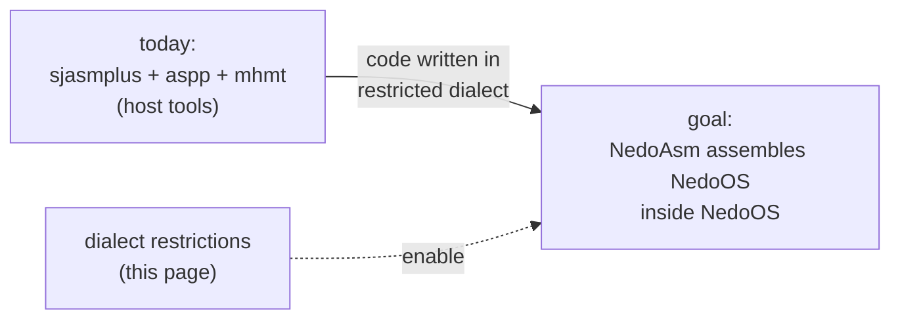

# Coding Guidelines: The NedoOS Assembler Dialect & Etiquette

*Prev: [API catalog](api-catalog.md) · Up: [Documentation hub](../README.md)*

Sources: the *"The system is currently unable to assemble itself"*
essay in [`nedoos_en.md`](../../NedoOS/src/nedoos_en.md), the macro
contracts in [`sys_h.asm`](../../NedoOS/src/_sdk/sys_h.asm), and the
house style visible across `src/`.

## The self-hosting goal

NedoOS's long-term ambition is to build **on itself** — so all in-tree code
follows a lowest-common-denominator dialect that the in-system tools
([NedoAsm](../05-applications/development-tools.md)) can digest. The rules
below are not aesthetic preferences: each one removes a sjasmplus feature the
native assembler does not (yet) implement.



## Dialect rules

| Rule | Rationale / replacement |
|---|---|
| Hex as `0xffff` (never `#ffff`, `0FFh`) | one canonical numeric format; binary only as `0b0101` if unavoidable |
| No operation-priority assumptions | parenthesize; if an expression *starts* with `(`, prefix a `+` so parsers don't see it as an operand |
| Unsigned-only arithmetic in expressions | native assembler will be unsigned first |
| `if a != b`, never `ifn a == b` | negated forms are rarely implemented |
| Single `ORG` at the top | reserve space with `ds addr-$` instead of re-`ORG`-ing |
| No `DUP..EDUP` | large repeats → `include` in a loop-free way; small ones expand manually |
| No `EQU`, no `STRUCT` — use `=` | constants and structure offsets are plain `NAME=offset` assignments (see all of `sysdefs.asm`) |
| No numeric labels / `1b` / `1f` jumps | named labels only — `1f` especially is unparseable for simple assemblers |
| One instruction per line, one operand set | no `ld a,1 : ld b,2` packing |
| Encoding Windows-1251 or CP866 — **not UTF-8** | the whole toolchain (and the console font) is 8-bit Cyrillic |
| Avoid external build utilities | everything except the assembler and NedoLang must eventually run in-system |

## House style (observed conventions)

* 8-space indentation for instructions, labels start at column 0,
  comments after `;` aligned loosely — follow `kernel/*.asm`.
* Lowercase for instructions and labels; constants historically
  `UPPERCASE=0x1234`.
* Structure offsets spelled `STRUCT_FIELD=offset` (`app_id`, `FCB_FSIZE`)
  rather than assembler-managed structs.
* `include "../_sdk/sys_h.asm"` first in every program; call the OS only
  through the `OS_*`/`SETPG*`/`QUIT` macros — register preservation and the
  page trampoline are the macros' business.

## Stack & memory discipline

* Move `SP` to `0x4000` (never below `SYSMINSTACK 0x3b00`) before any
  syscall — the kernel reuses low memory for its own stacks.
* Code lives at `ORG PROGSTART (0x0100)`; there is no relocation.
* Treat `0x0000..0x00FF` as kernel property (the trampoline page); the plan
  is to hand it to users later, so never poke it except via documented
  vectors (e.g. the interrupt-capture recipe below).
* Pages you own: obtained with `OS_NEWPAGE`, mapped with
  `SETPG4000/8000/C000` macros (they corrupt `BC` and record the page in
  `curpg16k`/`curpg32klow`/`curpg32khigh` — the kernel relies on those
  mirrors). Release unused pages with `OS_DELPAGE`; visual apps release the
  second screen page this way to grow the free pool.

## Multitasking etiquette

* **Never `halt`.** The scheduler runs from the frame interrupt only for
  *other* tasks; waiting must go through `YIELD`, `YIELDGETKEYLOOP`,
  `WAITPID`-style polling loops. A `halt`-loop still yields (IM1 keeps
  ticking) but wastes a full frame per iteration at best — the canonical
  busy-retry is `loop: OS_YIELD; jr loop`.
* Check focus: `OS_GETKEY` returns `nz` when your task is **not** in focus
  (mouse data then must be ignored).
* Honour `key_redraw` (31): when the user switches visual tasks with
  SS+Enter, your app gets this synthetic key — repaint.
* Long operations (file copies, decompression) should call `YIELD` between
  chunks; file APIs already yield per sector.
* GUI apps call `OS_HIDEFROMPARENT` early so a closed parent does not reap
  them; console apps inherit stdio handles instead.

## Interrupt capture recipe

The documented pattern (from the manual) for taking over the 50 Hz IM1
interrupt without breaking the kernel:

```asm
swapimer                    ;first call installs handler,
                            ;second call restores standard one
        di
        ld hl,(0x0038+3)    ;address of kernel intjp
        ld (intjpaddr),hl
        ld de,0x0038
        ld hl,myhandler
        ld a,0xc3           ;jp opcode
        ld (de),a : inc de  ;(split into separate lines in real code!)
        ...
        ret
myhandler:
        push af : push bc : push de   ;standard entry sequence
        ...
        jp (intjpaddr)      ;chain to kernel handler
```

Rules: replace exactly the 3 bytes at `0x0038` with `jp you`, save
`intjp` from `0x0038+3` before overwriting, enter your handler with
`push af/bc/de` (the standard prologue), and chain to the saved address.
Keep `di`-sections short — the scheduler lives on that interrupt.

## Error handling

* File calls: check `A` (0 = ok) or Cy per the
  [API catalog](api-catalog.md) family tables; print diagnostics via
  `say.asm` helpers or plain `OS_PRCHAR`.
* Sockets: negative `HL`/`L` = error, errno in `A`; on `ERR_EAGAIN` retry
  *with* `YIELD`.
* Never abort the machine on user errors — return a nonzero result in `HL`
  to `QUIT` and let the shell report it (`$?`-style, see
  [shell](../05-applications/shell-and-terminals.md)).

## Text & localization

* Console text is CP866 (Cyrillic); Ukrainian CP1125 is supported by the
  keyboard recoder. Source files: Windows-1251 or CP866 — a UTF-8 file will
  render garbage and break the native assembler.
* The `winto866` utility converts Windows text files for on-system use.
* Pseudographic box-drawing uses the ATM font's CP866 cells;
  `textwindow.asm` centralizes it.

## Adding an application to the build

1. Create `src/<app>/` with `<app>.asm` following the skeleton in
   [SDK overview](sdk-overview.md) and a `build.bat`/`Makefile` copied from
   a sibling (`emptyapp` is the template).
2. Add the directory to `SUBDIRS` in [`src/Makefile`](../../NedoOS/src/Makefile)
   (asm apps) or use the `kapps/` + `_sdk/iar.mk` flow for IAR C apps.
3. Binaries land in the release TRD/HDD images via `nedotrd`/`dmimg`
   (see [build system](../06-tools-and-build/build-system.md)).
4. GUI apps: also consider an entry in `nv.ext`-style associations
   (see [file management](../05-applications/file-management.md)).

## See also

* [SDK overview](sdk-overview.md) — macros and runtime libraries.
* [Process model](../02-architecture/process-model.md) — why the yield rules
  exist.
* [Interrupt & timing](../02-architecture/interrupt-and-timing.md) — what the
  frame interrupt does with your handler.
