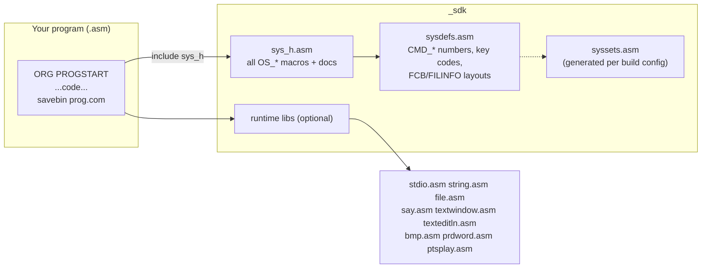
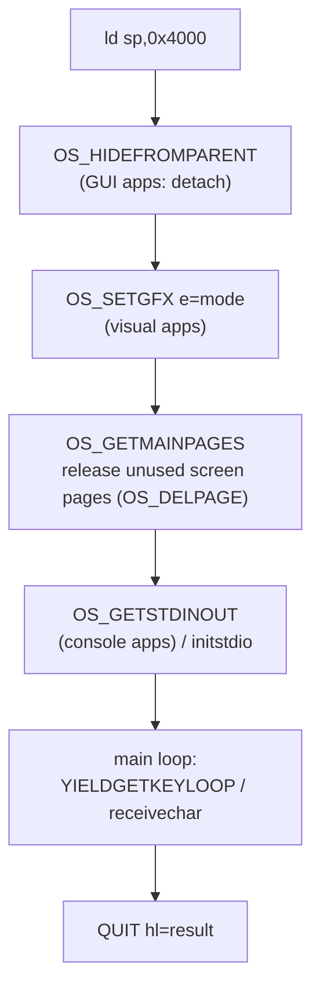

# SDK Overview: Headers, Macros, Runtime Libraries

*Up: [Documentation hub](../README.md) · Next: [API catalog](api-catalog.md)*

Sources: [`_sdk/`](../../NedoOS/src/_sdk) itself — `sysdefs.asm`,
`sys_h.asm`, `stdio.asm`, `string.asm`, `file.asm`, the contracts in
[`api_base.txt`](../../NedoOS/src/_sdk/api_base.txt) /
[`api_net.txt`](../../NedoOS/src/_sdk/api_net.txt), and the library
subdirectories.

The SDK is everything a NedoOS program includes from
[`NedoOS/src/_sdk`](../../NedoOS/src/_sdk). It is header-only by design:
assembly-time macros, structures and constants — plus a handful of optional
runtime libraries you `include` into your binary.

## Anatomy



| File | Purpose |
|---|---|
| [`sys_h.asm`](../../NedoOS/src/_sdk/sys_h.asm) | every syscall wrapped in a documented macro (`QUIT`, `OS_GETKEY`, `OS_OPENHANDLE`, `YIELD`, …) plus terminal-level macros (`SETXY_`, `PRCHAR_`) |
| [`sysdefs.asm`](../../NedoOS/src/_sdk/sysdefs.asm) | function codes, key codes, FCB/FILINFO offsets, app flag bits, `PROGSTART`/`COMMANDLINE` |
| `syssets.asm` | generated by the build (`syssets-atm2` etc.); apps needing platform awareness include it (discouraged for user programs) |
| [`stdio.asm`](../../NedoOS/src/_sdk/stdio.asm) | pipe-aware stdio: `initstdio`, `sendchar(s)`, `receivechar(s)`, `getkey`, cursor/colour/scroll helpers |
| `string.asm` | string helpers (`strcopy`, comparison, number formatting used by apps) |
| `file.asm` | file convenience wrappers (open/read/write/seek patterns) |
| `say.asm` (+`say.txt`) | decimal/hex number printing helpers |
| `textwindow.asm`, `texteditln.asm` | window drawing and line-edit widgets used by `nv`, `cmd` and friends |
| `bmp.asm` | BMP rendering pieces (used by viewers) |
| `prdword.asm` | 32-bit print helper |
| `ptsplay.asm` | PT3 playback helper for apps |
| `espnet.asm` + `espnet_h.asm` | user-side ESP8266 socket client (macro-swapped in for ESP builds) |
| `api_base.txt` / `api_net.txt` | official Russian API essays (ground truth for contracts) |
| `codepage/` | CP866↔ATM font conversion tables |
| `config/` | per-app `*.cfg` build fragments |
| `convega/`, `nedores/`, `nedopad/`, `nedotrd/` | **host** utilities with sources (see [host tools](../06-tools-and-build/host-tools.md)) |
| `common.mk`, `iar.mk`, `iar.lib` | build plumbing for asm apps and IAR C apps |
| `logo-*.{png,svg,jpg}` | boot logo art |

## The canonical minimal program

```asm
        DEVICE ZXSPECTRUM128
        include "../_sdk/sys_h.asm"
        ORG PROGSTART
        ld sp,0x4000            ; safe stack for OS calls
        ; ... your code ...
        ld hl,0                 ; result code
        QUIT
        savebin "progname.com",PROGSTART,$-PROGSTART
```

Conventions baked into this skeleton:

* `DEVICE ZXSPECTRUM128` so sjasmplus emits plain 128K-banking-compatible code.
* Stack moved to `0x4000` (≥ `SYSMINSTACK 0x3b00`) before any BDOS call.
* Result code passed in `HL` to `QUIT`.
* Output is a raw `.com` image — the OS loader relocates nothing; it simply
  maps pages and jumps to `0x0100`.

## Larger app skeleton (from `cmd`, `nv`, `term`)



## Runtime library highlights

### stdio.asm

Call-level (not macro) library; link by `include` and `call`:

* `initstdio` — captures stdin/stdout handles + terminal height;
* `sendchar`/`sendchars`/`receivechar`/`receivechars` — byte streams through
  whatever the handles point at (console, pipe, file);
* `getkey`, `yieldgetkeyloop` — key-level input with yielding;
* `setxy/setx/setcolor/scrollup/scrolldown/clearterm/clearrestofline` —
  terminal widget operations that `term`/`netterm` translate.

Macro shorthands (`PRCHAR_`, `GETCHAR_`, `SETXY_`, `CLS_`, `SETCOLOR_`) exist
so code can be switched between raw OS console and terminal-stdio by defining
one symbol.

### Strings, numbers, text UI

* `string.asm` — the workhorse string routines used across `cmd`, `nv`,
  `browser` (copy, compare, scan for delimiter, upcase, 8.3 formatting).
* `say.asm` — prints `DE`, `DEHL`, hex bytes with the console's CP866 mapping.
* `textwindow.asm` — boxed windows with colour attributes (the `nv` panels and
  dialogs); `texteditln.asm` — single-line editor with cursor keys used for
  command lines and URL entry.

### NedoLang runtime

[`nedolang/`](../../NedoOS/src/nedolang) ships `iofast` — a fast file layer
used by the kernel FAT path — plus `comp/` (the compiler itself) and
`_sdk/*.i` headers for the language; see
[development tools](../05-applications/development-tools.md).

## The IAR C toolchain (kapps)

[`_sdk/iar.lib`](../../NedoOS/src/_sdk/iar.lib) + [`_sdk/iar.mk`](../../NedoOS/src/_sdk/iar.mk)
build C programs (the `kapps/` family — `zifi`, `nc`, `girc`, `dns`, …) with
the IAR compiler, linking against `sys_h`-equivalent C headers
(`kapps/common/*.c`, `kapps/iarlib/`). The Make variables
(`BIN`, `SRCC`, `SRCA`, `XCLFILE`, `CONSOLE`) drive the process; output is the
same `.com` format.

## Cross-checking the SDK against the kernel

* Every macro in `sys_h.asm` maps 1:1 onto a `CMD_*` constant in
  `sysdefs.asm`, which in turn indexes the kernel's `tbdoscmds` table — the
  [API catalog](api-catalog.md) lists all three together.
* Structure offsets (`FCB_*`, `FILINFO_*`) match the kernel's use in
  `sysbdos.asm`; they are duplicated deliberately so user code never includes
  kernel sources.
* Key code tables (`ext*`, `ss*`, `cs*`, `key_*`) mirror the recoding engine
  in `syskey2.asm`.

## See also

* [API catalog](api-catalog.md) — the complete call reference.
* [Coding guidelines](coding-guidelines.md) — the dialect rules.
* [Building apps](../06-tools-and-build/build-system.md) — Makefile plumbing.
