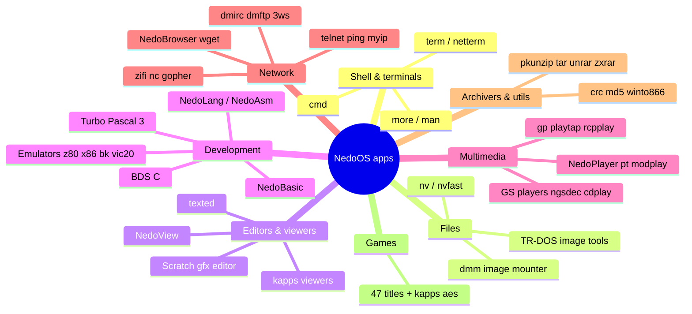

# Applications Overview: The NedoOS Userland

*Up: [Documentation hub](../README.md) · Next: [Shell & terminals](shell-and-terminals.md)*

NedoOS ships one of the largest application ecosystems of any ZX-Spectrum
compatible OS: a shell, file managers, editors, compilers, a web browser,
media players, archivers, emulators and dozens of games. This section
catalogues them from the sources under
[`NedoOS/src`](../../NedoOS/src) and the official manual
([`nedoos_en.md`](../../NedoOS/src/nedoos_en.md)).

## The landscape



## Application taxonomy

Every program is a `.com` file loaded at
[`PROGSTART`](../04-sdk/sdk-overview.md). Two broad shapes exist:

| Shape | How it talks | Examples |
|---|---|---|
| **Console app** | stdin/stdout/stderr handles (console, pipes, files) via `stdio.asm`; text output through `term`'s ANSI stream | `cmd`, `ping`, `tar`, `more` |
| **Visual (GUI) app** | calls `OS_SETGFX`, owns screen pages, receives focus & `key_redraw`; usually `OS_HIDEFROMPARENT` | `nv`, `texted`, `browser`, games |

The boundary is permeable by design: `term` turns a GUI-less system into a
console; pipes connect console apps like Unix:

```mermaid
flowchart LR
    KBD[keyboard] --> T[term.com<br/>ANSI terminal]
    T -->|stdin pipe| S[cmd.com]
    S -->|stdout pipe| T
    S -->|redirect >| F[report.txt]
    S -->|pipe | | M[more.com]
    M -->|stdout pipe| T
```

## Source layout

| Tree | Language / toolchain | Notes |
|---|---|---|
| [`src/<app>/`](../../NedoOS/src) | Z80 asm, sjasmplus + `_sdk` | ~50 programs; each has `Makefile` + `build.bat` |
| [`src/kapps/`](../../NedoOS/src/kapps) | C, IAR compiler (`_sdk/iar.mk`) | ~40 apps: `zifi` wifi manager, `nc` file manager, `girc`, `gopher`, `dns`, viewers, `pkzip`, … |
| `src/dmapps/*` | (DimkaM's apps) | `settime`, `3ws`, `dmftp`, `dmirc`, `dmm`, `helloworld` — referenced by `src/Makefile` `SUBDIRS`; sources not present in this snapshot (see [build system](../06-tools-and-build/build-system.md)) |
| [`src/games/`](../../NedoOS/src/games) | mostly C with Evo SDK (`games/_sdk`, SDCC) | 47 titles; see [games](games.md) |
| [`src/nedolang/`](../../NedoOS/src/nedolang) | NedoLang/NedoAsm themselves | the self-hosting toolchain (see [development tools](development-tools.md)) |

## Category pages

| Page | Covers |
|---|---|
| [Shell & terminals](shell-and-terminals.md) | `cmd`, `term`, `netterm`, `more`, `man`, `reset`, boot flow |
| [File management](file-management.md) | `nv`/`nvfast`, `dmm`, TR-DOS image tools (`mktrd`/`rdtrd`/`wrtrd`/`gettrd`), `hddfdisk` |
| [Editors & viewers](editors-and-viewers.md) | `texted`, `view` (NedoView), `scratch`, `setfont`, kapps viewers |
| [Development tools](development-tools.md) | `basic`, `tp`, `bdsc`, `nedolang`, emulators (`z80`, `x86`, `bk`, `vic20`), `zxzvm`, `nmisvc`, `untr` |
| [Multimedia](multimedia.md) | `player`, `pt`, `modplay`, `gp`, `playtap`, `rcpplay`, `shay`, `ngsdec`, GS family |
| [Network applications](network-apps.md) | `browser`, `wget`, `telnet`, `ping`, `myip`, `dmirc`, `dmftp`, `3ws`, `zifi`, … |
| [Archivers & utilities](archivers-and-utils.md) | `pkunzip`, `tar`, `unrar`, `zxrar`, `crc`/`md5`, `winto866`, `calc`, `menu`, misc |
| [Games](games.md) | the `games/` tree highlights |

## How programs get started

1. **From the shell** — typing `foo` runs `foo.com` from the current
   directory, else from `bin/` on the system drive
   ([shell details](shell-and-terminals.md)).
2. **From `nv`** — Enter on a `.com`/`.$c` launches it; other extensions go
   through the `nv.ext` association file, e.g.
   `bmp, scr: scratch.com` / `bat: cmd.com`
   ([file management](file-management.md)).
3. **From a `.bat` script** — sequential, except `start` backgrounds them.
4. **At boot** — `idle` runs `term.com`, which spawns `cmd.com
   autoexec.bat` (diagram in [shell & terminals](shell-and-terminals.md)).
5. **By the OS** — `nmisvc` integrates `.SNA` snapshots as if they were
   tasks ([development tools](development-tools.md)).

Blocking vs background matters everywhere: a launched child normally blocks
its parent until `QUIT` (or `OS_HIDEFROMPARENT`), while `start` / GUI apps
return control at once — the process rules are in the
[process model](../02-architecture/process-model.md).

## Cross-cutting application features

* **Keyboard** — Ext+letter = ASCII control codes 1..26; Ext+Number =
  F1..F10; full code table in the [API catalog](../04-sdk/api-catalog.md).
* **Mouse** — Kempston mouse with wheel; wheel scrolls `term`/`nv`; clicks
  are delivered as ANSI sequences by `term`.
* **Text encoding** — CP866 console text, CP1251/UTF-8 conversion in
  `browser` and `texted` (F10).
* **Sound** — AY/TurboSound via `OS_SETMUSIC`, Covox/SD via
  `OS_PLAYCOVOX`, General Sound/NeoGS through the GS port protocol
  ([multimedia](multimedia.md)).
* **Result codes** — `HL` at `QUIT` surfaces as the child result the parent
  can fetch with `OS_GETCHILDRESULT`.

## See also

* [Requirements](../01-introduction/goals-and-requirements.md) — what the
  app set is *for*.
* [SDK overview](../04-sdk/sdk-overview.md) — how apps are built.
* [Source map](../07-appendix/source-map.md) — the exhaustive directory
  inventory.
