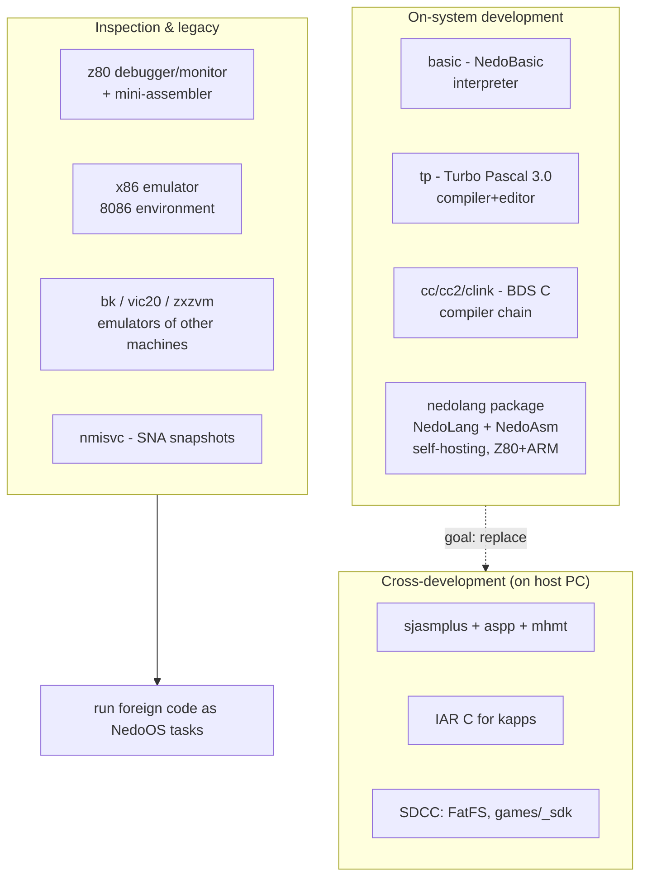
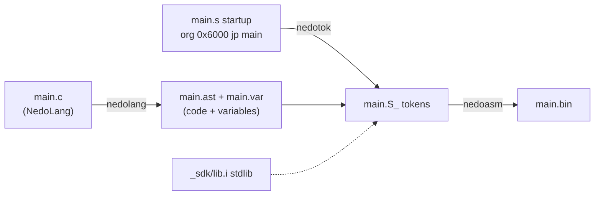

# Development Tools: basic, tp, bdsc, nedolang, emulators

*Prev: [Editors & viewers](editors-and-viewers.md) · Next: [Multimedia](multimedia.md)*

Sources: [`basic/`](../../NedoOS/src/basic), [`tp/`](../../NedoOS/src/tp),
[`bdsc/`](../../NedoOS/src/bdsc), [`nedolang/`](../../NedoOS/src/nedolang),
[`z80/`](../../NedoOS/src/z80), [`x86/`](../../NedoOS/src/x86),
[`bk/`](../../NedoOS/src/bk), [`vic20/`](../../NedoOS/src/vic20),
[`zxzvm/`](../../NedoOS/src/zxzvm), `nmisvc`,
plus the manual's language sections.

## The tool pyramid



## basic — NedoBasic interpreter

Runs `.bas` files given on the command line. Data model:

* **integers** — 32-bit signed; 0=false, -1=true (using them as loop
  indices costs extra memory);
* **strings** — up to 255 bytes + terminator; double as byte arrays;
* **1-D integer arrays**.

Single-letter variable names: `i` (number), `a$` (string), `a(10)` (array
element), `a$(10)` (string character). Expression priorities (lowest→
highest): comparisons `= < > <= >= <>`; `+ -`; `* /`; unary `-` and `()`.
`$rnd` yields 0..65535 (mind the space after the name).

### Command set

| Command | Meaning |
|---|---|
| `run` / `list` / `quit` | execute; list; exit |
| `edit <expr>` | edit line by number |
| `clear` / `new` | reset variables / program |
| `let v=<expr>` | assignment |
| `print e; e` | output (`;` at end suppresses newline) |
| `cls` | clear screen black |
| `goto <expr>` | jump (nonexistent line → next line) |
| `if <expr> then <cmd>` | conditional rest-of-line |
| `dim v(<expr>)` | allocate array |
| `for v=a to b step c` / `next v` | loop (step ≠ 0) |
| `rem <text>` | comment |
| `gfx 0` / `gfx 6` | 320×200×16 graphics / back to text (auto-reverted on exit) |
| `pause` | wait key |
| `plot x,y,c` | pixel |
| `line x2,y2,c` | line from previous point |
| `save <file>` / `load <file>` | program persistence (paths ok, string var ok) |
| `system <cmdline>` | run via `cmd`, wait for it |

Multiple commands per line separated by `:`; Esc interrupts program or
listing. `system` + blocking semantics make NedoBasic a scripting layer
over the shell — [shell](shell-and-terminals.md) commands are callable.

Sources: [`basic.asm`](../../NedoOS/src/basic/basic.asm) interpreter core,
[`bascmds.asm`](../../NedoOS/src/basic/bascmds.asm) command dispatch,
`example.bas` / `example.thk` samples.

## tp — Turbo Pascal 3.0 (Borland)

The classic TP3 IDE and compiler, adapted to NedoOS: shortcut hints are on
screen; sources compile **to memory or to file**; the target is the CP/M
subset of the OS API (FCB calls 0x0f–0x22 — see
[API catalog](../04-sdk/api-catalog.md)). Examples in-tree: `t.pas`
(Hello in a loop) and `mc.pas` (a spreadsheet!). Original English docs:
`http://www.retroarchive.org/docs/software/turbodoc.html`.

TP3 is the reason the kernel keeps the CP/M calls alive at all, and why
`CMD_RNDRD/RNDWR` honour the "TP uses bytes 21,22" layout.

## bdsc — BDS C compiler

Leor Zolman's BD Software C compiler, 8080-lineage: `cc`, `cc2` (second
pass, auto-invoked), `clink` linker, `c.ccc`, `deff*.crl` runtime.
Workflow from the manual:

```text
cc ex.c            /* compile ex.c → ex.crl          */
clink ex           /* link → ex.com                   */
clink ex deffgfx   /* link with graphics library      */
```

* Object files and libraries use the **`.crl`** extension; `deff2.crl` is
  auto-linked.
* `deff2a.csm`, `deffgfx.csm` are library sources (`cut.c`/`concat.c` are
  host-side tools for splitting/joining `.csm` streams).
* The tree also carries full compiler sources translated to run under
  NedoOS (`CC*.ASM`, `CLINK*.ASM`, `CASM.C`, `STDLIB*.C`, `STDIO.H`).

`cc.bat ex` compiles, links and runs — the 1980-style inner loop NedoOS
reproduces faithfully.

## nedolang — the self-hosting toolchain

[`nedolang/`](../../NedoOS/src/nedolang) is NedoOS's own language package
(documented in Russian in `nedolang.txt`):

* **NedoLang** is a *strictly-typed subset of C*; programs written to its
  compatibility rules also compile with an ordinary C compiler when
  `nedodefs.h` is included.
* The package produces **loadable programs and ROMs for Z80 *and* ARM
  Thumb** with no external utilities; the ARM target includes the Russian
  1986VE1T Cortex-M MCU (its own subdirectory with demos).
* Crucially, **the compiler compiles itself**, so development can happen on
  a real Z80 — the flagship of the self-hosting goal
  ([coding guidelines](../04-sdk/coding-guidelines.md)).

### The three-stage build



Directory map: `comp/` (the NedoLang compiler), `asm/` (NedoAsm with `z80`
and `arm` backends — `asmf_*`, `asmj_*`, `nedoaarm`), `tok/` (tokenizer),
`exp/`, `diff/`, `batch/`, `_gui/`, plus demo projects (`nedodel`,
`nedogift`, `sprtest`, `movedisk`). The `_sdk/lib.i` runtime and the
**iofast** fast-file layer (also used by the kernel's FAT path) live here.

## z80 — debugger, disassembler, mini-assembler

[`z80/`](../../NedoOS/src/z80) is an interactive machine-code monitor for
NedoOS itself: `debugger.asm`/`debugsrv.asm` (register/memory views),
`disasm.asm` + `z80table.asm` (disassembler), `asm.asm`/`asmsrv.asm`
(mini-assembler — type instructions, get code bytes back), `editline.asm`,
`ports.asm`. Use it to inspect running tasks, patch binaries on disk, or
learn the [syscall interface](../03-kernel/syscall-interface.md) live.

## x86 — 8086 environment

[`x86/`](../../NedoOS/src/x86) is an 8086 CPU emulator with a debugger and
its own command shell: `decoder.asm` (disassembly view), `opcodes.asm` +
`x86logic.asm` + `x86math.asm` (interpreter), `ints.asm` (BIOS-style
interrupts), `keyscan.asm` (PC keyboard mapping), `x86.ini` config and the
CP866 font. It targets running simple PC-era software and low-level
experiments as a NedoOS task.

## Other machines inside NedoOS

| Emulator | Machine | Notes |
|---|---|---|
| [`bk/`](../../NedoOS/src/bk) | **BK-0010** (Soviet PDP-11 home computer) | full tree: CPU core, `bktable.asm`, `ints.asm`, own font `866_code.fnt`, `bk.ini` |
| [`vic20/`](../../NedoOS/src/vic20) | **Commodore VIC-20** | 6502 core + memory map |
| [`zxzvm/`](../../NedoOS/src/zxzvm) | **Infocom Z-machine** | runs Z-code adventure games (37 files: compiler-side tools + VM) |
| `untr/` | **unreal.exe tracker helper** | Unreal/CM speccy tooling bridging (see `untr/` docs) |

## nmisvc — snapshot runner

`nmisvc` (documented in the manual; sources not in this snapshot — see
[source map](../07-appendix/source-map.md)) runs a `.SNA` snapshot (48K or
128K) named on the command line as
if it were a NedoOS task: press the **NMI** button to leave the snapshot,
save the machine state to a *new* snapshot, or resume; you may switch to
other OS tasks meanwhile — snapshots multitask with the OS. It can also
start TR-DOS BASICs. This is the compatibility bridge for the enormous
existing ZX software base ([history](../07-appendix/history-and-credits.md)).

## Templates

* [`hello/`](../../NedoOS/src/hello) — minimal console program.
* [`emptyapp/`](../../NedoOS/src/emptyapp) — minimal GUI app skeleton
  (the copy-paste starting point for new applications).

## See also

* [Coding guidelines](../04-sdk/coding-guidelines.md) — the dialect these
  tools impose.
* [Build system](../06-tools-and-build/build-system.md) — host-side
  compilation.
* [SDK overview](../04-sdk/sdk-overview.md) — headers every tool uses.
