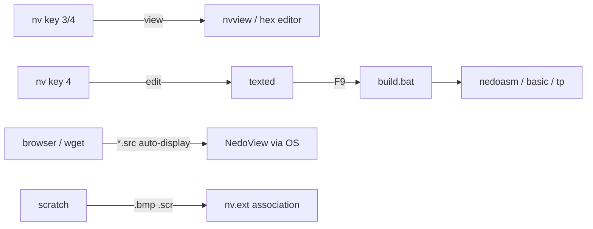

# Editors and Viewers: texted, NedoView, Scratch

*Prev: [File management](file-management.md) · Next: [Development tools](development-tools.md)*

Sources: [`texted/`](../../NedoOS/src/texted), [`view/`](../../NedoOS/src/view),
[`scratch/`](../../NedoOS/src/scratch), [`setfont/`](../../NedoOS/src/setfont),
the kapps viewers, and the manual.

## texted — text editor

Invoked as `texted filename`; the only limit on file size is free memory
(pages are allocated as the text grows — the
[memory map](../02-architecture/memory-map.md) pooled-page model at work).

| Key | Action |
|---|---|
| cursor, PgUp, PgDn | movement |
| Home / End | line start / end |
| SS+PgUp / SS+PgDn | text start / end |
| BackSpace / Del | delete left / right |
| Ins | word wrap on/off |
| F1 | help |
| **F2** or CS+Enter | save |
| **F9** | run `build.bat` in the file's directory |
| **F10** | switch encoding 866/1251 |
| Esc (Break) | exit |

F9 makes `texted` the front end of the
[development tools](development-tools.md) workflow: edit sources, press F9,
read the compiler output. `nv`'s key **4** delegates here.

## view — NedoView, the image viewer

[`view/view.asm`](../../NedoOS/src/view/view.asm) + per-format modules
(`888.asm`, `chr.asm`, `grf.asm`, `deblc.asm` + `dzx0b.asm` decompression).
Supported formats (manual list):

| Format | What it is |
|---|---|
| `scr` (6144 / 6912) | standard ZX screen, with or without attributes |
| `fnt` (768 / 2048) | fonts — linear or screen-order |
| `img` | dual-screen interlace |
| `3` | AGA editor 8-colour |
| `888` | 8-colour editor |
| `+` / `-` | MultiStudio editor |
| `Y` | packed 8-colour for ManyColor+/XColor |
| `plc` | Laser Compact 5 / BGE (packed) |
| `mc`, `mlt`, `mcx` | multicolor (ZX Paintbrush; `mcx` interlaced) |
| `grf` | hardware multicolor ATM/Profi |
| `ch$` | large pictures with attributes (optionally interlaced) |
| `mg1/2/4/8` | MultiArtist editor |
| `rm` | R-Mode |
| `16c` | 32K memory image + 32-byte palette |

`browser` covers the *photographic* formats — jpeg/gif/png/bmp/svg — see
[network apps](network-apps.md); NedoView specialises in ZX native art.

## scratch — graphics editor

[`scratch/`](../../NedoOS/src/scratch) is the EGA 320×200 editor (the
`nv.ext` association `bmp, scr: scratch.com` opens images here). Source
layout shows the scope: `bitmap.asm`, `prbitmap.asm` (BMP import),
`prshapes.asm`, `prtext.asm`, `prarrow.asm` (tools), `window(s/h).asm`
(UI framework), `pal.asm` (DDp 4+4+4 palette handling), `navigator.asm`,
`files.asm`, `control.asm`, plus math modules (`math.asm`, `tarcsin`,
`tsqrt_max2` — trigonometry/sqrt tables for freehand tools). Works with
multiple windows and its own `.fnt` assets (`64qua.fnt`).

## setfont — console font installer

[`setfont.asm`](../../NedoOS/src/setfont/setfont.asm) loads a font into the
text-mode screen: ships `866_code.fnt` (Cyrillic CP866),
`1125code.fnt` (Ukrainian CP1125) and `atmucode.fnt` (ATM unicode layout).
Used at setup time to match the console to the user's encoding — pairs with
`winto866` ([utilities](archivers-and-utils.md)) when transporting texts
from Windows.

## kapps viewers (IAR C)

| App | Format |
|---|---|
| [`sxgview`](../../NedoOS/src/kapps/sxgview) | SXG vector drawings |
| [`textview`](../../NedoOS/src/kapps/textview) | large text files with paging |
| [`ansiview`](../../NedoOS/src/kapps/ansiview) | ANSI art (colour ESC sequences) |
| [`scaview`](../../NedoOS/src/kapps/scaview) | SCA images |
| [`getpic`](../../NedoOS/src/kapps/getpic) | screen capture/inspector helper |

All use the kapps `common/` terminal library, so they render into any
`term`/`netterm` console.

## Where editing meets the OS

* Text pipeline: `nv` → `texted` → `build.bat` → compiler.
* Image pipeline: `nv.ext` → `scratch` (editing) or `view` (viewing);
  network downloads auto-display in viewers.
* The hex editor inside `nv` (`nvhexed.asm`) covers binary patching.

## See also

* [Development tools](development-tools.md) — what F9 typically builds.
* [Multimedia](multimedia.md) — players that render visualizations.
* [SDK text widgets](../04-sdk/sdk-overview.md) — `textwindow.asm` /
  `texteditln.asm` shared UI code.
