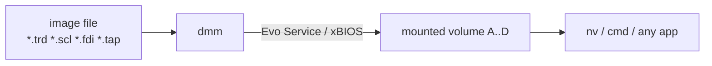

# File Management: nv, dmm, Image & Disk Tools

*Prev: [Shell & terminals](shell-and-terminals.md) · Next: [Editors & viewers](editors-and-viewers.md)*

Sources: [`nv/`](../../NedoOS/src/nv) (Nedovigator), `dmapps/dmm`,
[`mktrd`](../../NedoOS/src/mktrd) / [`rdtrd`](../../NedoOS/src/rdtrd) /
[`wrtrd`](../../NedoOS/src/wrtrd) / [`gettrd`](../../NedoOS/src/gettrd),
`kapps/nc`, `kapps/deltree`, `kapps/hobeta`, and the manual.

## nv / nvfast — Nedovigator

The dual-pane file manager, NedoOS's "Midnight Commander". Sources:
[`nv.asm`](../../NedoOS/src/nv/nv.asm) core plus `nvfind.asm` (file search),
`nvhexed.asm` (hex view/edit), `nvview.asm` (text viewer), `nvsort.asm` +
`heapsort.asm` (sort modes), `nvclock.asm`, `nvunit.asm`, `nvjptbl.asm`,
`cmdpr.asm` (the command line). `nvfast` is the same UI built for the
fast-memory layout.

### Keys (number = same as F-key on PS/2)

| Key | Action |
|---|---|
| Up/Down, Home, End | navigate; jump first/last |
| Tab | switch panel |
| Space | tag file |
| Ext+A | invert tagging |
| BackSpace | parent directory |
| Enter | launch file / run command line (blocking, see below) |
| CS+Enter or F9 | insert filename into command line |
| **1** (F1) | select drive for panel |
| **2** | find files (Tab switches filename/substring fields) |
| **3** | view text — F1 encoding, Ins line-breaks, Tab hex mode (F2 save, type hex digits) |
| **4** | edit file in `texted` |
| **5** | copy tagged/file to opposite panel |
| **6** | rename |
| **7** | make directory |
| **8** | delete tagged (empty dirs only) |
| SS+1..5 | sort mode: name, extension, size, date, none (repeat = reverse) |
| Esc | exit (Enter confirms) |

When Enter launches a child, `nv` yields focus and waits for completion or
`OS_HIDEFROMPARENT`; the child's console output is retained and can be
scrolled back with the mouse wheel (`nv`) or Esc (`nvfast`).

### nv.ext — extension associations

```text
bmp, scr: scratch.com
bat: cmd.com
```

`Enter` on an unknown extension consults `nv.ext` on the system disk:
`ext-list: launcher` — the launcher is invoked with the file as argument.
This is the user-level plugin mechanism; the shipped file wires graphics
into Scratch and scripts into `cmd`.

## nc — NedoCommander (kapps, IAR C)

[`kapps/nc`](../../NedoOS/src/kapps/nc) is a C re-imagining of the
commander with aggressive memory engineering (from its own header comment):

* main code+data at `0x0100..0xBFFF`; a **resident** code block at
  `0xC000..0xFFFF`;
* per-panel OS pages (`OS_NEWPAGE`): file list pages holding ~180
  `fileInfo` records each plus a meta page with sorting state and a copy
  of `nv.ext`;
* dedicated copy-engine pages: copy-cache, snapshot page for interrupted
  copies, I/O page and copy stack — multi-bank copies survive panels
  scrolling underneath.

It demonstrates the "many small pages" pattern the
[memory map](../02-architecture/memory-map.md) makes affordable.

## dmm — disk image mounter

Mounts **TRD, SCL, FDI, TAP** images via **Evo Service** (ZX Evolution
firmware call); on ATM2 it can mount TR-DOS images through the **xBIOS**
ROM instead. Mounted images appear as regular TR-DOS volumes, so the whole
file API works on them. (`hddfdisk`-formatted images can even be loop
mounted this way.) Sources: `dmapps/dmm` (not in this snapshot — see
[build system](../06-tools-and-build/build-system.md)).



## TR-DOS image tools

Built on `OS_READSECTORS`/`OS_WRITESECTORS`
([filesystem stack](../03-kernel/filesystem-stack.md#raw-sector-access)):

| Tool | Direction | Purpose |
|---|---|---|
| [`mktrd`](../../NedoOS/src/mktrd) | create | make an empty TR-DOS image |
| [`rdtrd`](../../NedoOS/src/rdtrd) | image → files | unpack TR-DOS image into current dir |
| [`wrtrd`](../../NedoOS/src/wrtrd) | files → image | pack files into a TR-DOS image |
| [`gettrd`](../../NedoOS/src/gettrd) | copy out | extract a TR-DOS image from a floppy to file |
| `kapps/rdtrd2`, `kapps/wrtrd2` | both | IAR C rewrites with long-name mapping |
| `kapps/hobeta` | convert | Hobeta (`.$C`/`.$B`) file ⇄ image plumbing |

The host-side counterparts used at build time (`nedotrd`, `dmimg`) are
covered in [host tools](../06-tools-and-build/host-tools.md).

## hddfdisk — IDE partitioner

Partition/format utility for IDE drives creating the table the kernel's
volume layer reads to map partitions `E..H` (master) and `I..L` (slave).
Runs entirely through the raw-sector API; documented in the manual's
hardware-setup flow ([hardware platforms](../01-introduction/hardware-platforms.md)).

## Other file utilities

* `kapps/deltree` — recursive delete (the shell's `del` only removes empty
  directories by design).
* `copydir` (in `cmd`) — recursive copy, full paths required.
* `3ws` doubles as a remote file browser via HTTP
  ([network apps](network-apps.md)).
* `dmftp` / `wget` move files in from the network
  ([network apps](network-apps.md)).

## See also

* [Filesystem stack](../03-kernel/filesystem-stack.md) — volumes, FAT,
  TR-DOS internals.
* [Archivers & utilities](archivers-and-utils.md) — packed-file handling.
* [API catalog](../04-sdk/api-catalog.md) — the calls these tools use.
