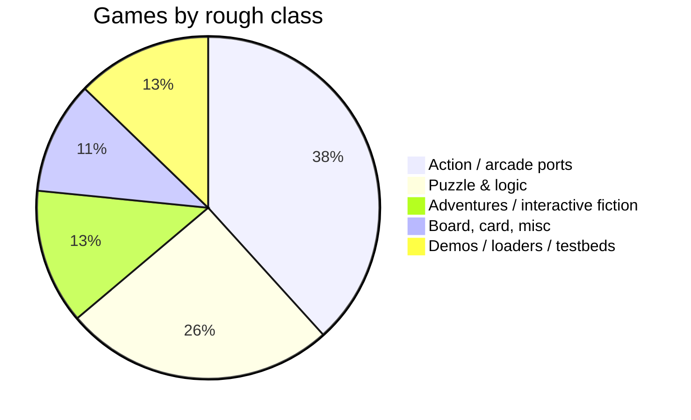
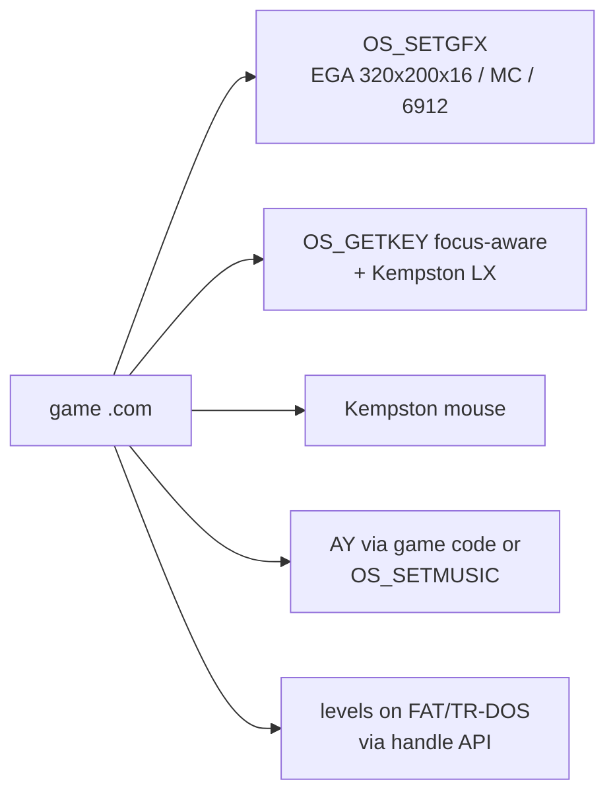

# Games

*Prev: [Archivers & utilities](archivers-and-utils.md) · Up: [Applications overview](applications-overview.md)*

Sources: [`games/`](../../NedoOS/src/games) (47 titles + `Makefile` +
`_sdk` = Evo SDK), [`moon-rabbit-zx/`](../../NedoOS/src/moon-rabbit-zx),
[`mrabbit-fusion/`](../../NedoOS/src/mrabbit-fusion), `kapps/aes`,
[`zxzvm/`](../../NedoOS/src/zxzvm) (adventures), and per-game readmes.

## Scale and build

`games/Makefile` builds the maintained subset — `snake tank tetris
untangle wolf3d br eric` — installing into `release/nedogame`; the full
tree holds **47 games** from quick toys to full engine ports. Everything
compiles against **Evo SDK** (`games/_sdk`, SDCC-based C framework with
`crt0` startup, `ayfxplay` sound, `as-z80` assembler; docs
`evosdk.txt`/`evosdk_eng.txt`) or plain asm against `_sdk`.

*(classification of the 47 directories, judgemental)*

## Headliners

| Game | What it is |
|---|---|
| [`wolf3d`](../../NedoOS/src/games/wolf3d) | **Wolfenstein 3D** raycasting engine with beeper SFX (`beeper.asm`, `beeper_sfxdata.asm`), AY effects (`ayfxplay.asm`), animated sprites (`anims.asm`), 48K/128K loaders (`loader48.txt`) |
| [`q1`](../../NedoOS/src/games/q1) | **Quake demake** — `Quake1_2.asm` engine, `MAPS.bin`, custom font |
| [`smb`](../../NedoOS/src/games/smb) | **Super Mario Bros** via an in-tree **6502 interpreter** (`6502.asm`/`6502fast.asm`) running the NES original; ships a TAS movie (`antipac.fm2`) |
| [`touhou-zero`](../../NedoOS/src/games/touhou-zero) | Touhou-style bullet hell demake (see its `README.md`) |
| [`2048`](../../NedoOS/src/games/2048) | the 2048 puzzle |
| [`worms`](../../NedoOS/src/games/worms) | Worms-like with separate 48K build (`worms48.txt`) and `whist` card game |
| [`mrabbit` — `moon-rabbit-zx`](../../NedoOS/src/moon-rabbit-zx), [`mrabbit-fusion`](../../NedoOS/src/mrabbit-fusion) | **Moon Rabbit** platformer; `mrabbit-fusion` is the Evo-Fusion edition (22 sources, 9 asset dirs) |
| [`zxzvm` games](../05-applications/development-tools.md) | Infocom Z-machine adventures via the built-in VM |

## The full roster

`A-World-of-One-way-main` (puzzle), `B_O_D`, `balls`, `barbaria`, `bq`,
`br`, `cyrus2` (with manual), `dots`, `eric`, `hws`, `innsmouth`
(Lovecraftian text adventure), `isitar`, `loyd` (Lloyd puzzles),
`loadscr`/`nedoload` (loaders), `manreq`, `MeisouToshi`, `midnight`,
`montana2`, `mrkom` (adventure, with walkthrough), `net` (networked
games), `numtris`, `puzzle`, `robocop`, `Saku_R`, `SanShimai`, `slabage`,
`snake`, `solkey` (solitaire), `sprexamp` (SDK sample), `tank`,
`tenkosei`, `tetris`, `tngogo`, `ufo2`, `untangle`, `uwol`, `vera`,
`xnx`, `zxbattle` — plus the headliners above.

## Why games matter architecturally

* Games are the stress test of the
  [process model](../02-architecture/process-model.md): they grab focus,
  hog the frame interrupt with raster tricks, and must still yield.
* `wolf3d`-class engines validated the **noturbo** flag of `OS_SETGFX`
  (turbo modes break cycle-expectant code) and the dual-screen-page model
  ([memory map](../02-architecture/memory-map.md)).
* `smb` proves foreign CPUs can be emulated at playable speed inside a
  NedoOS task — the same trick `bk`, `vic20`, `x86` use
  ([development tools](development-tools.md)).
* Multiplayer experiments live in `games/net` over the
  [network stack](../03-kernel/network-stack.md).

## Distribution

Built games install to `release/nedogame` on the release images
([release images](../06-tools-and-build/release-images.md)); `nv` launches
them via Enter, and `menu`/`autoexec.bat` often present a curated list.

## See also

* [Applications overview](applications-overview.md).
* [Hardware platforms](../01-introduction/hardware-platforms.md) — what
  the games assume.
* [History & credits](../07-appendix/history-and-credits.md) — the many
  authors behind the ports.
