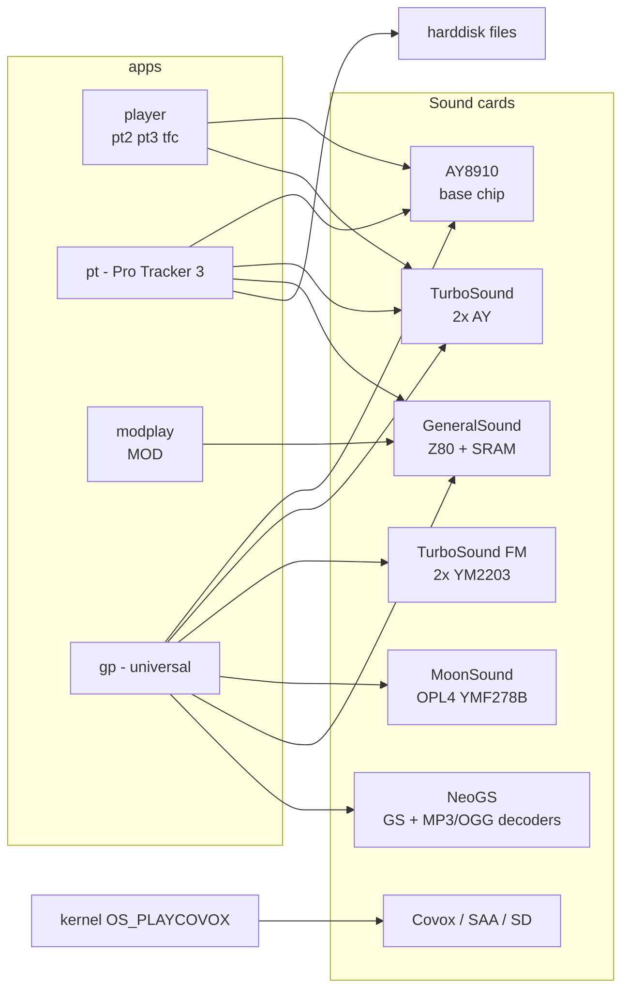

# Multimedia: Players, Trackers, Sound Utilities

*Prev: [Development tools](development-tools.md) · Next: [Network applications](network-apps.md)*

Sources: [`player/`](../../NedoOS/src/player), [`pt/`](../../NedoOS/src/pt),
[`modplay/`](../../NedoOS/src/modplay), [`gp/`](../../NedoOS/src/gp)
(`gp_en.txt`), [`playtap/`](../../NedoOS/src/playtap),
[`rcpplay/`](../../NedoOS/src/rcpplay), [`shay/`](../../NedoOS/src/shay),
kapps sound apps, and the kernel's `OS_SETMUSIC`/`OS_PLAYCOVOX` calls.

## The sound hardware zoo

NedoOS addresses more sound hardware than any other ZX OS — a player
declares which cards it drives and the OS just delivers memory windows:

## player — NedoPlayer

Simple player for `*.pt2`, `*.pt3` (with **TurboSound** dual-AY support)
and `*.tfc`: filename on the command line, name shown on refresh, Esc to
quit. Playback runs through the kernel's `OS_SETMUSIC`, so music continues
while you use other tasks ([API catalog](../04-sdk/api-catalog.md)).

## pt — Pro Tracker 3.x

The full **Pro Tracker 3.x** tracker adapted to NedoOS: bigger edit window
than the original, loads/saves modules on **hard disk**, optional
**General Sound** output (separate manual shipped with releases). The
classic AY music-workstation, now a native task.

## modplay — MOD on General Sound

Minimal `.mod` player for General Sound-compatible cards: the Z80 streams
the file to the card's own firmware mixer. Running it without a parameter
stops playback.

## gp — the universal player

[`gp/`](../../NedoOS/src/gp) plays *everything everywhere* (from
`gp_en.txt`):

| Format | Played on |
|---|---|
| `mp3` | NeoGS |
| `ogg` / `aac` | NeoGS rev.CM (VLSI VS1053/VS1063) |
| `mid` | NeoGS rev.CM + MIDI UART on AY port A.2 (e.g. MultiSound card) |
| `vgm` / `vgz` | AY, MoonSound (YM3526/YM3812/YMF262/YMF278B), TurboSound FM (2×YM2203), YM2151, YM2608 |
| `mwm` | MoonSound |
| `pt2` / `pt3` | AY; pt3 also TurboSound (2×AY) |
| `mod` | MoonSound; GeneralSound/NeoGS via card firmware |
| `s3m` | MoonSound |

Cards supported: **AY8910, GeneralSound, NeoGS, MoonSound/BomgeMoon,
TurboSound, MultiSound (2×YM2151 + YM2608)**. Behaviour is tuned by
[`gp.ini`](../../NedoOS/src/gp/gp.ini): `UseNGS/UseMWM/UsePT3/UseVGM/
UseMoonMod/UseMoonMid` toggle players to shrink memory footprint;
`MoonModDefaultPanning=5AA5` fixes headphone panning. Internals:
`NUM_PLAYERS=6` subsystems (`pt3.asm`, `vgm.asm`, `mp3.asm`, `moonmod.asm`,
`moonmid.asm`, `mwm.asm`) + `ngsdec/` decoder glue; a playlist model with
52-byte per-file records; `progress.asm` UI. Known quirk documented in
`gp_en.txt`: ZXM-MoonSound firmware 1.0 is broken on ZX-Evolution/baseconf
(OPL4 ports 7E/7F unusable).

## rcpplay — Recoser RCP player

[`rcpplay`](../../NedoOS/src/rcpplay) plays **RCP** (Recomposer) MIDI
sequences (`main_rcp_robo.asm`) using the **YRW801** Yamaha wavetable ROM
sample data bundled in `yrw801/` — targeting MoonSound-class hardware.

## playtap — tape output

Emits a `.tap` file through the **physical tape-out** port (the file must
be named `tilt.tap`) — for loading real Spectrums or recording to tape.

## shay — AY silencer

One-shot utility (see its `README`): writes `0xFF` to the AY mixer
register and `0` to all volume registers — "SHut down AY". Handy after
misbehaving software leaves channels open.

## kapps sound tools (IAR C)

| App | Role |
|---|---|
| [`cdplay`](../../NedoOS/src/kapps/cdplay) | NeoGS/CD-style track player |
| [`playwav`](../../NedoOS/src/kapps/playwav) | WAV playback through GS/NGS |
| [`tgvplay`](../../NedoOS/src/kapps/tgvplay) | TGV music format |
| [`ngsplay`](../../NedoOS/src/kapps/ngsplay) | NeoGS-specific player |
| [`zxart-radio`](../../NedoOS/src/kapps/zxart-radio) | streaming "radio" over HTTP ([network apps](network-apps.md)) |
| [`gstest`](../../NedoOS/src/kapps/gstest) | General Sound hardware test |

## Kernel hooks players rely on

* `OS_SETMUSIC` (`CMD_SETMUSIC`) — hand a module at `0x4000..0x7FFF` (+
  one page for `0x8000`) to the kernel's interrupt-driven AY engine;
  `hl=0` stops it. This is why `player` music survives task switches.
* `OS_PLAYCOVOX` (`CMD_PLAYCOVOX`) — sample stream at `0xC000+` with a
  page table and rate word (`18`≈11 kHz, `7`≈22 kHz, `1`≈44 kHz) for
  Covox-class DACs.
* Soundcard DMA protocols (GS/NeoGS port protocol) are driven directly by
  the apps, not the kernel — the kernel deliberately stays AY-only.

## See also

* [Interrupt & timing](../02-architecture/interrupt-and-timing.md) — the
  engine underneath `OS_SETMUSIC`.
* [Games](games.md) — in-game music reuse.
* [kapps common](../05-applications/applications-overview.md) — C-side
  helpers.
