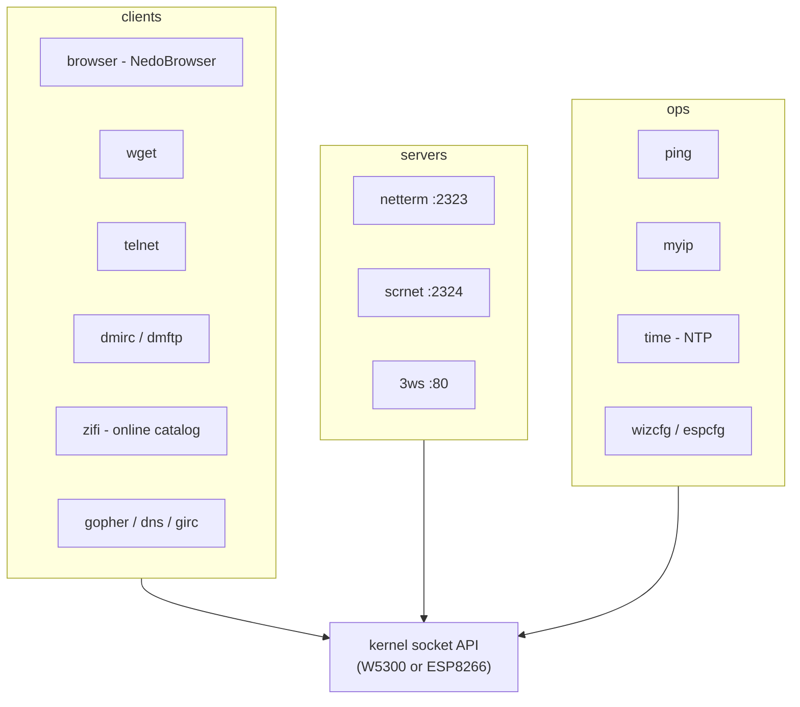
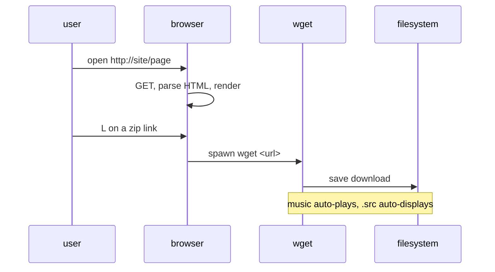

# Network Applications: browser, wget, telnet, servers

*Prev: [Multimedia](multimedia.md) · Next: [Archivers & utilities](archivers-and-utils.md)*

Sources: [`browser/`](../../NedoOS/src/browser), `wget`, `dmapps/*`,
[`ping/`](../../NedoOS/src/ping), [`telnet/`](../../NedoOS/src/telnet),
[`myip/`](../../NedoOS/src/myip), [`scrnet/`](../../NedoOS/src/scrnet),
kapps network family, and the manual. The machinery underneath is the
[network stack](../03-kernel/network-stack.md).

## The application map

## browser — NedoBrowser

The text-mode web browser ([`browser.asm`](../../NedoOS/src/browser/browser.asm)
+ 27 modules):

* URLs: `browser file://m:/girl.jpg` (the `file://` is optional) and
  `browser http://alonecoder.nedopc.com/`; **HTTPS works through a proxy**.
* Formats: **HTML** (subset of tags; windows-1251 & UTF-8), **JPEG**
  (plain scan), **GIF** (normal scan, animated), **PNG** (normal scan),
  **BMP** (24-bit, normal line order), **SVG** (no fill, limited coords).
* Status bar: full path, busy-page count, render time, errors
  (`conn.err` connection, `load err` loading).
* Rendering is done in hires MC mode with virtual pages — `mempgs.asm` /
  `dynmem.asm` juggle pages; `t64to16i`/`t64to16p`/`tdiv` are build-time
  code generators for 64→16-bit downscaling maths.

| Key | Action |
|---|---|
| cursor, PgUp, PgDn | scroll (large images pan) |
| Enter | follow hyperlink |
| S | save file as `download.fil` (a,b,c… prefixes per save) |
| L | download link target (spawns `wget`) |
| 5 | reload |
| E | edit URL |
| U | toggle UTF-8 / windows-1251 |
| BackSpace | history back |
| Z | zoom/scale images |
| Break (Esc) | exit |

## wget — downloader

Non-interactive HTTP fetcher. Nice touches: finished **music files are
played** and `.src` images **displayed** automatically on arrival.

## telnet — client

`telnet host` or `telnet host:port` (default 23) — the user-facing side of
the TELNET protocol.

## Servers on the speccy

| Server | Port | What it serves |
|---|---|---|
| [`netterm`](../../NedoOS/src/netterm) | TCP **2323** | a full remote console (see [shell & terminals](shell-and-terminals.md)); PuTTY: VT-100, echo off, line editing off, Backspace=Ctrl-H |
| [`scrnet`](../../NedoOS/src/scrnet) | HTTP **2324** | publishes the live screen over HTTP; backend chosen via `/ini/network.ini` |
| `3ws` | HTTP **80** | web server **sharing the system disk**; custom page design in its own subdirectory; details in `3ws.txt` |

Because `netterm` is just pipes, anything that reads stdin can be driven
remotely — a poor man's SSH into a 3.5 MHz Z80.

## Operational tools

* **ping** — ICMP `ECHO_REQUEST`, `ping 1.2.3.4`; exercises the kernel's
  synthesized ICMP sockets.
* **myip** — print effective network configuration.
* **time** (NTP client) — options: `-H` help, `-T hh:mm:ss` set time,
  `-D dd-mm-yyyy` set date, `-N server` (default `2.ru.pool.ntp.org`),
  `-Z` timezone (default 3), `-i` fetch date/time from the internet.
* **wizcfg** — basic ZXNETUSB network setup, storing to
  [`net.ini`](../../NedoOS/src/net.ini).
* **dmirc / dmftp** — IRC chat and FTP file transfer clients (dmapps).
* **`aynet/`** — historical AY-port networking experiment (`proto.txt`,
  `yad` tool), not part of the supported stack.

## kapps network family (IAR C)

| App | Role |
|---|---|
| [`zifi`](../../NedoOS/src/kapps/zifi) | **online file catalog & downloader**: HTTP/1.0 to the same PHP backends as the TSConf client; records are 5 CRLF lines (title/url/year/author/city); zips fetched via a remote-unzip proxy that prefixes the real extension; 80×25 text + mouse UI; `.scr` previews on screen 1 (`OS_SETGFX 0x83`), music via `player.ovl` overlay, auto-queues `zxart-radio` when a PT3 ends; `/` or F searches (CP866 typed → UTF-8 URL) |
| [`gopher`](../../NedoOS/src/kapps/gopher) | gopher client (`nedogoph.gph` homepage) |
| [`girc`](../../NedoOS/src/kapps/girc) | IRC client |
| [`dns`](../../NedoOS/src/kapps/dns) | DNS lookup utility |
| [`atelnet`](../../NedoOS/src/kapps/atelnet) | alternate telnet client |
| [`espcfg`](../../NedoOS/src/kapps/espcfg) | ESP8266 configurator with live INFO (wifi state, RSSI, IP, SSID) |
| [`netprint`](../../NedoOS/src/kapps/netprint) | network printing |
| [`enet`](../../NedoOS/src/kapps/enet) / [`cuart`](../../NedoOS/src/kapps/cuart) / [`svnesp`](../../NedoOS/src/kapps/svnesp) | ESP / UART experiments, ESP firmware flasher helpers |
| [`zxart-radio`](../../NedoOS/src/kapps/zxart-radio) | streaming radio client ([multimedia](multimedia.md)) |
| `common/espnet*.c`, `network.c` | shared C socket layer mirroring `sys_h.asm` macros |

## Usage patterns

* Browse → download → view/listen without leaving the OS.
* Remote administration through `netterm`; screen sharing through `scrnet`;
  file sharing through `3ws`.
* `time -i` + RTC ([hardware](../01-introduction/hardware-platforms.md))
  keeps FAT timestamps honest.

## See also

* [Network stack](../03-kernel/network-stack.md) — drivers & socket API.
* [Shell & terminals](shell-and-terminals.md) — netterm details.
* [I/O & pipes](../02-architecture/io-and-pipes.md) — how servers reuse
  the console plumbing.
