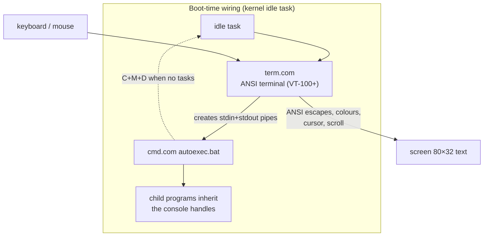

# Shell and Terminals: cmd, term, netterm

*Prev: [Applications overview](applications-overview.md) · Next: [File management](file-management.md)*

Sources: [`cmd/cmd.asm`](../../NedoOS/src/cmd/cmd.asm) (+`cmdpr.asm`),
[`term/term.asm`](../../NedoOS/src/term/term.asm), and the manual sections
for `cmd`, `term`, `netterm`, `more`, `man` in
[`nedoos_en.md`](../../NedoOS/src/nedoos_en.md).

## The console stack



When no tasks remain, `idle` loops waiting for the **C+M+D** chord to spawn
a fresh `cmd`; `term` (or the network `netterm`) is how you get *another*
independent console.

## cmd — the command interpreter

An interactive prompt with horizontal scrolling and command recall
(Cursor-Up). It executes two file types, dispatched on the *first character
of the extension*:

* **`.com`** — executable, launched as a new parallel task; arguments are
  delivered at `COMMANDLINE` (0x0080, length at the same address);
* **`.bat`** — a script of `cmd` commands; lines run sequentially (echoed
  before execution), except `start`ed ones which run in background.

Programs on the **`bin/`** directory of the system disk can be invoked from
anywhere; the current directory always wins if the same name exists there.
The shell's CWD does not change when running programs.

### Built-in commands

| Command (aliases) | Meaning |
|---|---|
| `exit` | quit the shell |
| `a:` … `o:` | change current disk |
| `dir` (`ls`) | list directory (`dir> filename` redirects to file) |
| `cd <path>` / `cd ..` | change directory (path may carry a drive) |
| `md` (`mkdir`) `<path>` | create directory |
| `del` (`rm`) `<path>` | delete file or empty directory |
| `copy` (`cp`) `<src> <dst>` | copy file |
| `ren <src> <dst>` | rename / move |
| `mem` (`free`) | free memory pages count |
| `proc` (`ps`) | process list: `+`/`-` active, `g` graphical |
| `drop` (`kill`) `<ID>` | terminate task by id |
| `date` | print date & time |
| `rem` | no-op (bat comments) |
| `start <path>` | run program in background |
| `copydir <dir1> <dir2>` | recursive copy — **full** paths required |
| `pause` | wait key (bat) |
| `echo <msg>` | print message (bat) |
| `type <path>` | print file |

### Redirection & scripting

```text
dir > filename.txt        /* capture output        */
dir | more.com            /* pipe into pager       */
more < filename.txt       /* feed stdin from file  */
```

`.bat` parameters are available as `%0`..`%9` (`%0` = script filename).
With a `autoexec.bat` argument the shell stays interactive afterwards;
otherwise it exits when its command line is exhausted — the mechanism that
lets `nv` and `basic` run one-shot commands.

## term — the on-screen terminal

[`term.asm`](../../NedoOS/src/term/term.asm) is the ANSI terminal every
console app renders into:

* **ANSI codes, VT-100+ subset** with mouse events encoded into the stream;
* mouse-wheel scrolling through the console buffer (`STDINBUF_SZ=256`,
  `READPASTABUF_SZ=80` read-past-ahead);
* click in the **top-left corner** saves the visible terminal text to
  `pasta.txt`; click in the **bottom-left corner** pastes the first 80
  bytes of `pasta.txt` into stdin (a poor man's clipboard);
* works in text mode 80×32 and the hires MC mode (`TEXTMODE=0` build
  yields 6-pixel `CHRHGT`, HTML-ish `HTMLHGT=33` rows);
* `term` itself calls `OS_HIDEFROMPARENT` — closing the parent shell does
  not kill the terminal.

A new terminal is spawned with the `term` command; several can coexist as
separate tasks with separate pipes.

## netterm — TELNET server

`netterm` exposes the same stdio plumbing over TCP **port 2323**: remote
keypresses arrive as stdin, program output streams back as ANSI. Client
settings (e.g. PuTTY): **VT-100, local echo off, local line editing off,
Backspace = Ctrl-H**. Multiple `netterm` tasks serve multiple sessions;
each is an independent console for piping experiments
([I/O & pipes](../02-architecture/io-and-pipes.md)).

## Auxiliary console tools

| Tool | Role |
|---|---|
| [`more`](../../NedoOS/src/more) | classic pager — the right side of `dir | more` |
| [`man`](../../NedoOS/src/man) | manual-page viewer for the on-system docs (`*.hlp`, built by `Makefile.hlp`) |
| [`reset`](../../NedoOS/src/reset) | soft reset / reboot helper |
| [`hello`](../../NedoOS/src/hello) | canonical "hello world" sample |
| [`emptyapp`](../../NedoOS/src/emptyapp) | empty GUI app — the template for new programs |

## Design notes (from sources)

* `cmd.asm` defines `MAXCMDSZ=COMMANDLINE_sz-1`, draws its own 80-column
  prompt line (`CMDLINEY=24`) and calls `initstdio` first — everything the
  shell does with files and children goes through the documented BDOS
  handles, no kernel privileges.
* `term.asm` is a full GUI-style task: it owns screen pages, processes
  `key_redraw`, and translates both keyboard and mouse into ANSI bytes;
  children see only bytes on pipes.
* The `idle`→`term`→`cmd` chain means **the shell is replaceable** —
  `autoexec.bat` may launch `nv` or anything else instead; nothing in the
  kernel knows about `cmd`.

## See also

* [I/O & pipes](../02-architecture/io-and-pipes.md) — the pipe machinery
  underneath `|` and `>`.
* [Process model](../02-architecture/process-model.md) — task creation from
  the shell's point of view.
* [File management](file-management.md) — `nv`, the visual alternative.
