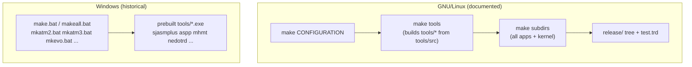

# Build System: GNU Make Cross-Build

*Up: [Documentation hub](../README.md) · Next: [Host tools](host-tools.md)*

Sources: [`src/Makefile`](../../NedoOS/src/Makefile),
[`src/README.linux`](../../NedoOS/src/README.linux) (the authoritative,
Russian, build instructions), [`_sdk/common.mk`](../../NedoOS/src/_sdk/common.mk),
per-directory `Makefile` + `build.bat` pairs, `_sdk/iar.mk`.

## Two build worlds



Linux dependencies: GNU coreutils, **GNU Make, GNU sed, GNU bash**, plus
locally built `tools/aspp` and `tools/sjasmplus`. The canonical flow:

```sh
make clean clean-release
make evolution        # or atm2 atm2hd atm3 atm3hd atm3sd pe26
# → ../release now holds everything for that target
```

## Hardware configurations (the `CONFIGURATION` target)

| Target | Platform | Notes |
|---|---|---|
| `atm2` | ATM Turbo 2 | floppy-centric |
| `atm2hd` | ATM Turbo 2 | + HDD |
| `atm3` | ATM3 | IDE + network |
| `atm3hd` | ATM3 | IDE + network |
| `atm3sd` | ATM3 | IDE + network, SD image set |
| `evolution` | ZX Evolution | IDE + network + **PS/2 keyboard** |
| `pe26` | Pentagon 2.666 LE | ATM2-style + network |

`make all` iterates every configuration. Each configuration first
generates [`_sdk/syssets.asm`](../../NedoOS/src/_sdk) — the kernel's
compile-time switchboard:

| Switch | Meaning (selected values) |
|---|---|
| `atm=` | platform id fed to `CMD_GETCONFIG` (1 Evo, 2 ATM2, 3 ATM3, 6 p2.666) |
| `sys_npages` | number of system pages |
| `NEMOIDE` / ATM IDE | IDE register dialect for `fatfsdrv.asm` |
| `SYSDRV` | default system drive letter |
| `INETDRV` | 0/1/2 → none / WIZnet W5300 / ESP8266 ([network](../03-kernel/network-stack.md)) |
| `PS2KBD` | PS/2 keyboard support |
| `atm2clock` | ATM2 real-time clock variant |

Because `syssets.asm` changes, the build is **configuration-clean**: switching
targets requires `make clean`.

## Directory makefiles

`src/Makefile` drives everything through `SUBDIRS` — the asm apps
(`cmd term nv texted …`), `kernel`, `fatfs4os`, `nedolang`, `games`,
`kapps` via `dmapps/*`, plus the utilities. Each subdirectory Makefile is
tiny because [`_sdk/common.mk`](../../NedoOS/src/_sdk/common.mk) provides
Make *functions*:

* `sjasmplus_rule` / `sjasmplus_odd_rule` — assemble one `.asm`, honouring
  the odd/even address alignment variants some modules need;
* `copy_file_rule` — install outputs;
* `SVNREVISION` extraction (stamped into binaries via `CMD_GETCONFIG`'s
  `IXBC` — the running OS can report the exact source revision!).

Install phases: `install` (binaries → `release`), `install-doc`
(documentation, driven by `Makefile.doc.en` / `Makefile.hlp` for on-system
`man` pages).

## FatFS caveat

`README.linux` TODO: *the FatFS subtree is **not built** on Linux* due to
open licensing questions on the sources/libraries used. Release images
embed the prebuilt `fatfs.raw` (see
[filesystem stack](../03-kernel/filesystem-stack.md)); rebuilding the FAT
core requires the original SDCC-based pipeline.

## kapps (IAR) builds

C applications under `kapps/` compile with the proprietary **IAR Z80
compiler** through [`_sdk/iar.mk`](../../NedoOS/src/_sdk/iar.mk):
per-app variables `BIN`, `SRCC`, `SRCA`, `XCLFILE` (linker placement) and
`CONSOLE`; `kapps/iarlib/` holds the C-side runtime (`sys_h` equivalents).
The resulting `.com` files are byte-compatible with the asm world.

## Continuous integration

The GitHub mirror ([`.github/workflows/sync-svn.yml`](../../NedoOS/.github/workflows/sync-svn.yml)
+ [`scripts/sync-svn.py`](../../NedoOS/scripts/sync-svn.py)) runs a
nightly SVN→Git synchronizer from `svn://nedoos.ru`, mapping SVN account
names to Git identities (Alone Coder, DimkaM, lvd, demige, …) and
maintaining `.svn-revision` (this snapshot: **r2685**). It is a *sync*,
not a build — the images are still produced by developers' machines.

## Troubleshooting the build

* `make tools` must succeed first (it compiles `aspp`, `sjasmplus`,
  `mhmt`, `dmimg` … from [`tools/src`](../../NedoOS/tools/src)).
* Windows line-endings in `.asm` sources break sed-based steps on Linux —
  the tree is committed with LF.
* A half-finished multi-config build confuses `syssets.asm` — when in
  doubt, `make clean clean-release` (the documented reset).

## See also

* [Host tools](host-tools.md) — what each tool does.
* [Release images](release-images.md) — what the build produces.
* [SDK overview](../04-sdk/sdk-overview.md) — the headers the build feeds
  to every app.
