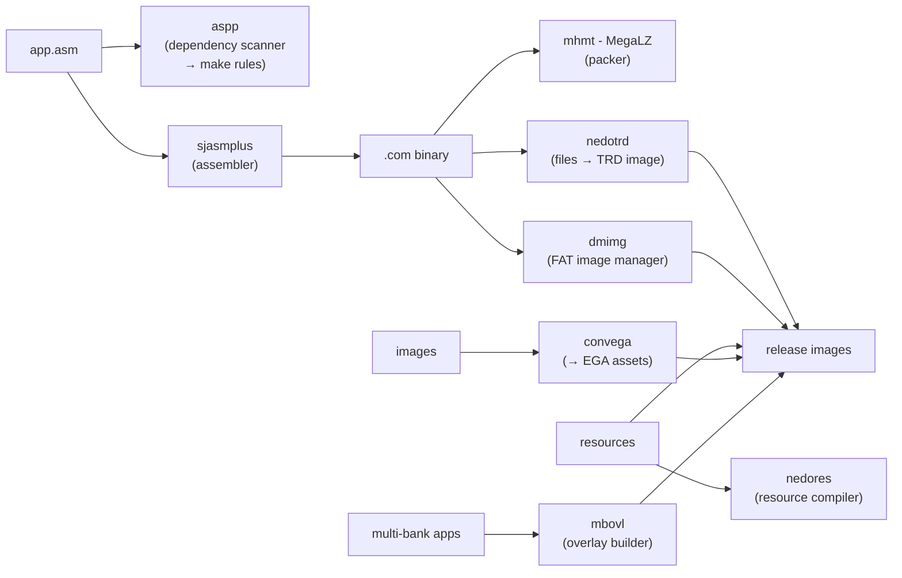

# Host Tools: the Cross-Compilation Toolchain

*Prev: [Build system](build-system.md) · Next: [Release images](release-images.md)*

Sources: [`tools/`](../../NedoOS/tools) (prebuilt binaries + scripts),
[`tools/src/`](../../NedoOS/tools/src) (their sources), and the helper
sources under [`_sdk/`](../../NedoOS/src/_sdk)
(`nedotrd/`, `nedores/`, `nedopad/`, `convega/`).

## The pipeline

## Tool reference

### Assembling

| Tool | Role |
|---|---|
| [`sjasmplus`](../../NedoOS/tools/src/sjasmplus) | the Z80 assembler everything compiles with (`DEVICE ZXSPECTRUM128` mode; `sjasmplus107.exe` kept for legacy modules) |
| [`aspp`](../../NedoOS/tools/src/aspp) | *"Simple assembler source file preprocessor… processes source's file dependencies and produces a text line to be used in makefiles"* (public domain, UNLICENSE) — the glue that makes `make` understand `.asm` includes |

### Packing & images

| Tool | Role |
|---|---|
| `mhmt` (`mhmt.i386`/`.exe`) | **MegaLZ** packer/unpacker; the kernel itself boots through `unmegalz` on `syscode.c.mlz` ([kernel structure](../03-kernel/kernel-structure.md)) |
| [`nedotrd`](../../NedoOS/src/_sdk/nedotrd) | creates/populates **TR-DOS** images from files (used by the `trd` make target) |
| [`dmimg`](../../NedoOS/tools/src/dmimg) | **FAT image manager** — interestingly built on FatFS itself (`ff.c`, `diskio.c` on the host); `dmimg-adddir.bat/.sh` inject whole directory trees into images |
| `mkfs.fat` | host-side FAT formatter source for preparing SD/HDD images |
| `chkimg.bat` | image sanity check |

### Application assets

| Tool | Role |
|---|---|
| [`nedores`](../../NedoOS/src/_sdk/nedores) | resource compiler — bundles data (fonts, tables, texts) into linkable blobs |
| [`nedopad`](../../NedoOS/src/_sdk/nedopad) | binary padding/alignment utility (fixed-layout data) |
| [`convega`](../../NedoOS/src/_sdk/convega) | converts images to the NedoOS **EGA** picture format |
| `mbovl` ([src](../../NedoOS/tools/src/mbovl/mbovl.c)) | builds **`.ovl` overlay codebanks** — how `zifi` ships its `player.ovl` music subsystem beyond the base image |
| `bas2tap` / `bin2tap` | make `*.tap` files (BASIC loaders / raw binaries) for `playtap` and real tapes (`bas2tap.md.txt` documents the format) |
| `images.exe` / `tazres.bin` | auxiliary image/resource helpers used by specific apps |

### Development conveniences

* `perl.exe`, `curl.exe` — bundled Windows utilities for scripts.
* [`1251to866.sh`](../../NedoOS/tools/1251to866.sh) — encoding conversion
  for texts (the sources are CP866/CP1251, see
  [coding guidelines](../04-sdk/coding-guidelines.md)).
* `parsasm.bat` — asm source analysis helper.
* `tools/mingw`, `tools/msys` — the Windows build environments the
  historical `.bat` scripts assume.

## Where each tool is needed

| You are building… | Tools used |
|---|---|
| kernel image | sjasmplus, aspp, mhmt, nedotrd (`trd` target), `savebin` hobeta step |
| asm app `.com` | sjasmplus, aspp, nedores (optional) |
| kapp (IAR C) | IAR compiler, `_sdk/iar.mk`, mbovl (if overlayed) |
| game (Evo SDK) | SDCC (`games/_sdk`), its `as-z80`, `crt0` |
| FatFS core | SDCC ([`tools/src/sdcc`](../../NedoOS/tools/src/sdcc)) — not wired into Linux make ([build system](build-system.md#fatfs-caveat)) |
| release SD/HDD image | dmimg, mkfs.fat, `dmimg-adddir` |
| `aynet` experiments | `aynet_psg` host analyzer |

## Emulation & test environment (`us/`)

[`us/`](../../NedoOS/us) is the reference *user station*: **UnrealSpeccy**
emulator (`emul.exe`/`emul64.exe` + `bass.dll`, `libpng12.dll`,
`zlib1.dll`), platform ROMs (`2006.ROM`, `DOS6_10E.ROM`, `GLUKATM.ROM`,
`QC_3_05.rom`, `xbios137.rom`, `zxevo_fe.rom`, `bootGS.rom`,
`yrw801.rom` — the last two for NeoGS/MoonSound), `NVRAM`, per-machine
configs (`emul.ini`, `atm2.ini`, `dimkam.ini`) and launchers
(`emulatm2.bat`, `emulcpu2.bat`, `atmmaxme.bat`). `tools/vhd` holds
ready-made VHD disk images for the HDD-capable configs.

## See also

* [Build system](build-system.md) — how the tools are orchestrated.
* [Release images](release-images.md) — what dmimg/nedotrd produce.
* [SDK overview](../04-sdk/sdk-overview.md) — the `_sdk` sources of four
  of these tools live beside the headers.
