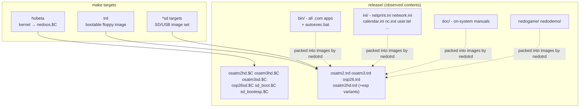

# Release Images and Deployment

*Prev: [Host tools](host-tools.md) · Up: [Documentation hub](../README.md)*

Sources: the `hobeta`/`trd`/`*sd` targets in [`src/Makefile`](../../NedoOS/src/Makefile),
the actual contents of [`release/`](../../NedoOS/release), and the manual's
system-setup chapter.

## What the build produces



### The `trd` recipe (verbatim flow)

```make
${NEDOTRD} test.trd -n                    # new empty TR-DOS image
${NEDOTRD} test.trd -ah BOOT6000.$$B      # boot block as hobeta
${NEDOTRD} test.trd -s 24576 -ac kernel/code.c   # kernel image, start 24576
for d in `find ${BIN_INSTALLDIR} -type f`; do
    ${NEDOTRD} test.trd -a $$d            # every app
done
```

Each configuration then moves the result to its release name:
`osatm2.trd`, `osatm3.trd`, `osevo.trd`, `ospe26.trd`/`osp26.trd` …
`hobeta`-flavoured configs produce `osatm2hd.$C` etc. — a Hobeta file
you can simply copy onto an existing TR-DOS disk to upgrade a kernel.

### Reading the name grammar

| Fragment | Meaning |
|---|---|
| `os` | NedoOS |
| `atm2` / `atm3` / `p(e)26` | target platform |
| `hd` | hard-disk installation image |
| `hm` | **maxmem** build (`mkatm2hd_maxmem.bat` — memory-hungry config) |
| `sd` | SD-card installation set |
| `esp` | **ESP8266** network variant (vs WIZnet default) |
| `.$C` | Hobeta container (`sd_boot.$C` is the SD bootstub) |

## Bootstrapping a machine

1. **Floppy path** — write `osatm2.trd` (etc.) to a real diskette or mount
   it in the emulator; the TR-DOS `BOOT6000.$B` loads the kernel at
   `0x6000` ([boot sequence](../03-kernel/kernel-structure.md)).
2. **HDD/SD path** — boot once from TRD, then copy the `.$C` kernel and
   the `bin/`+`ini/` trees to the hard disk / SD card (volumes `E..O`,
   see [filesystem stack](../03-kernel/filesystem-stack.md)); `sd_boot`
   variants simplify the SD case. The manual recommends the SD card as
   the system disk for emulator users.
3. `autoexec.bat` (in `bin/`) starts the default session; edit it to
   launch `nv`, `browser`, or a game menu instead.
4. `ini/network.ini` feeds the network stack
   ([net.ini format](../03-kernel/network-stack.md#configuration-file-net_ini));
   `ini/nc.ext` holds the C commander's associations (the `nv.ext`
   analogue).

## Emulator setup

The `us/` reference station ([host tools](host-tools.md#emulation--test-environment-us))
contains UnrealSpeccy with per-platform configs; `tools/vhd` has prepared
VHD hard-disk images. The manual's recipe: point the emulator at the TRD,
attach the VHD/SD image, enable the needed ROMs (TR-DOS 5.x, Gluk clock,
Evo baseconf for `evolution`), and boot.

## What ships in `bin/` (selection)

Everything from [applications](../05-applications/applications-overview.md)
— `cmd`-launched shells (`term`), managers (`nv`, `nc`), editors
(`texted`, `scratch`), viewers (`view`, `ansiview`, …), network suite
(`browser`, `telnet`, `3ws`, `zifi`, …), media (`player`, `gp`, `pt`,
`modplay`), archivers (`pkunzip`, `tar`, `unrar`, `zxrar`), development
(`basic`, `tp`, `bdsc`, nedolang tools, `z80`, `x86`), emulators (`bk`,
`vic20`), plus utilities and the games in `nedogame/`. `nedodemo/` holds
the demonstration set ([demos](../05-applications/applications-overview.md)).

## Versioning & provenance

* The kernel reports its **SVN revision** at runtime via `OS_GETCONFIG`
  (`IXBC`) — stamped at build time by `common.mk`.
* `nedoos.new` is the running changelog (dates + items, CP866); release
  announcements are cut from it
  ([history](../07-appendix/history-and-credits.md)).
* `.svn-revision` in the repo root records the synced upstream revision
  (this snapshot: r2685, via the nightly
  [sync workflow](build-system.md#continuous-integration)).

## See also

* [Build system](build-system.md) — how these targets are invoked.
* [Kernel structure](../03-kernel/kernel-structure.md) — what `BOOT6000`
  actually executes.
* [Hardware platforms](../01-introduction/hardware-platforms.md) — which
  image fits which machine.
