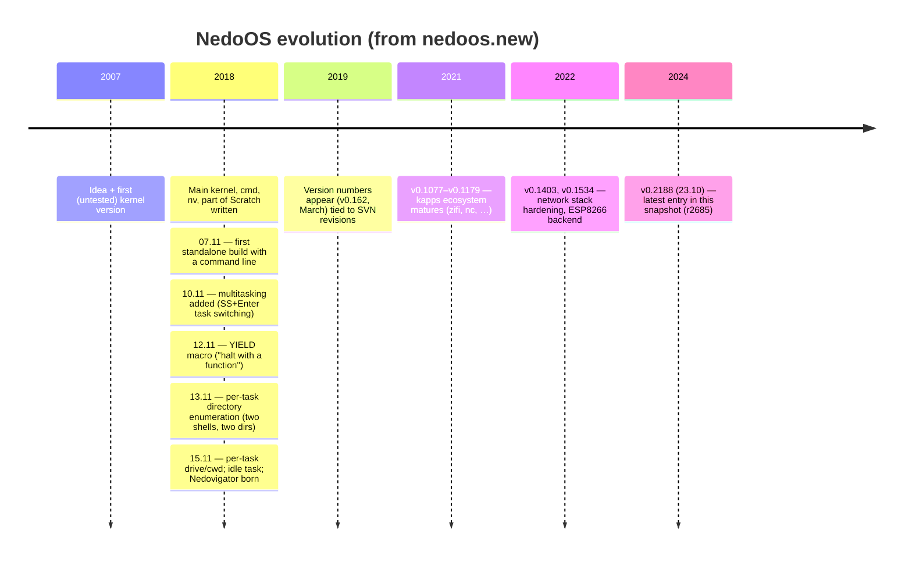

# History and Credits

*Prev: [Source map](source-map.md) · Up: [Documentation hub](../README.md)*

Sources: the "Developers" section of [`nedoos_en.md`](../../NedoOS/src/nedoos_en.md),
the changelog [`nedoos.new`](../../NedoOS/src/nedoos.new) (CP866,
147 dated entries), and the SVN/Git provenance files.

## Timeline

The idea predates the code by eleven years: the OS concept was drafted in
**2007** with a first, never-tested kernel; the serious work happened in
**2018**, when the kernel, `cmd`, `nv` and part of Scratch were written
and the changelog begins. Version tags like `v0.2188.1` mirror upstream
SVN revisions — the same number the running kernel reports via
`OS_GETCONFIG` ([API catalog](../04-sdk/api-catalog.md)).

Development happens in **Subversion** (`svn://nedoos.ru`); the GitHub
mirror is synchronized nightly by
[the sync workflow](../06-tools-and-build/build-system.md#continuous-integration),
which also maintains `.svn-revision`.

## The people

*(as credited in the official manual)*

| Contributor | Contribution |
|---|---|
| **Dmitry Mikhailovich Bystrov** (Alone Coder / Conscience) | project manager, code, documentation |
| **DimkaM** | networking, disk-subsystem patches, utilities, testing — the `dmapps` family |
| **Nikolay Aleksandrovich Grivin** | code and documentation |
| **Kirill Lovyagin** | NedoBasic (as Z80 assembly-language training) |
| **demige** | NedoBasic & Nedovigator development, Linux build scripts, utilities |
| **Lord Vader** | file sorting, Linux build fixes, `aynet_psg`, sjasm/UnrealSpeccy patches |
| **Konstantin Kosarev** | `rdtrd`, `wrtrd` |
| **Slip** (code), **nq** (music), **Videogames Sematary** (testing), Alone Coder (porting) | ZX Battle City |
| **Rasmer**, Alone Coder, **Sashapont** | Eric and the Floaters port |
| Alone Coder, Sashapont, **Kitty**, **Louisa** | Black Raven port |
| **Louisa, Sashapont, Wizard** | the boot logos (`_sdk/logo-*`) |
| **Savelij13** & DimkaM | FatFS disk drivers |
| ChaN | FatFS itself (EVAL license, credited in the manual) |
| many others | the 47 games, kapps, translations |

## Engineering culture, read from the changelog

The `+ / -` notation (added / fixed) and the density of "multitasking
correctness" fixes (per-task directories, deeper FatFS stacks, YIELD
semantics) show an OS **hardened by concurrent use from week two**. Notable
early entries:

* `10.11.2018` — "*added multitasking (except file operations, work
  ongoing)*" three days after the first standalone build;
* `12.11.2018` — the `YIELD` macro ("can perform the function of halt")
  after `CMD_YIELD` glitched;
* `15.11.2018` — per-task current drive **and** directory; "directory
  reads have no global state — directories can be read
  multitask-ingly"; the `idle` task that mounts drives and loads
  `cmd.com`; `PRCHAR` standardized on CP866.

## License

Free distribution of the program and its source code is allowed; porting
the code (or parts of it) to a different platform asks for the project
manager's approval — the manual's wording. Embedded third-party
components keep their own notices (FatFS EVAL; Evo SDK, SDCC, sjasmplus,
aspp sources under their licenses in-tree).

## See also

* [Overview](../01-introduction/overview.md) — what the project *is*.
* [Source map](source-map.md) — where everything lives.
* [Release images](../06-tools-and-build/release-images.md) — how the
  versions ship.
